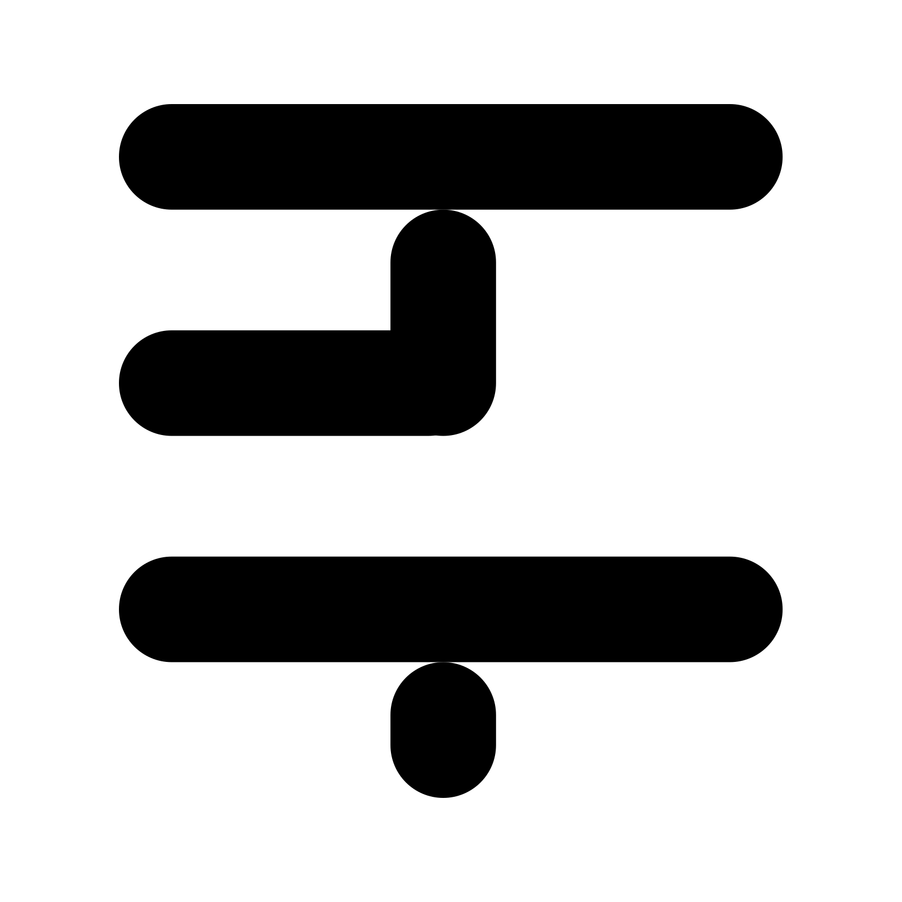

<div align="center">

<picture>
  <source media="(prefers-color-scheme: dark)" srcset="./assets/logo-square-dark.svg">
  
</picture>

# Kata Code

**A minimal web and desktop GUI for coding agents.**

Drive Codex, Claude, Cursor, and OpenCode from one interface — in the browser or as a native desktop app.

</div>

> [!WARNING]
> Kata Code is a very early work in progress. Expect bugs and breaking changes.

## Overview

Kata Code gives coding agents a single, consistent UI. It wraps provider CLIs and app-servers behind a WebSocket protocol, manages sessions and workspaces, and renders conversations and tool activity in a React UI shared across web, desktop, and mobile.

- **Multiple providers** — Codex, Claude, Cursor, and OpenCode through one interface.
- **Web and desktop** — the same UI runs in the browser and inside an Electron shell.
- **Workspace-aware** — sessions operate against real local repositories and worktrees.
- **Typed end to end** — Effect/Schema contracts shared between server and clients.

## Requirements

- [Node.js](https://nodejs.org) `^24.13.1`
- [pnpm](https://pnpm.io) `11.8.0`
- [Vite+](https://viteplus.dev/) (`vp`) for the monorepo toolchain:
  ```bash
  curl -fsSL https://vite.plus | bash
  vp check
  ```
- At least one authenticated provider:

  | Provider | Install                                               | Authenticate          |
  | -------- | ----------------------------------------------------- | --------------------- |
  | Codex    | [Codex CLI](https://developers.openai.com/codex/cli)  | `codex login`         |
  | Claude   | [Claude Code](https://claude.com/product/claude-code) | `claude auth login`   |
  | Cursor   | [Cursor CLI](https://cursor.com/cli)                  | `cursor-agent login`  |
  | OpenCode | [OpenCode](https://opencode.ai)                       | `opencode auth login` |

## Getting started

```bash
# install dependencies
vp i

# first time / fresh worktree: fetch the Electron runtime
vp run --filter @kata-sh/code-desktop ensure:electron

# run the web app (contracts + web + server)
pnpm run dev

# run the Electron desktop app
pnpm run dev:desktop
```

Default dev ports: web `5733`, server `13773`. Offset them with `KATACODE_DEV_INSTANCE` or `KATACODE_PORT_OFFSET` to run multiple instances.

> [!NOTE]
> If Electron reports `path.txt missing` after a fresh install, re-run `ensure:electron` (see above).

## Project structure

This is a pnpm + Vite+ monorepo.

| Path                      | Description                                                                                         |
| ------------------------- | --------------------------------------------------------------------------------------------------- |
| `apps/server`             | Node.js WebSocket server; wraps provider app-servers and serves the web app. CLI entry: `katacode`. |
| `apps/web`                | React/Vite UI — session UX, conversation and event rendering, client state.                         |
| `apps/desktop`            | Electron shell; spawns the embedded server in dev.                                                  |
| `apps/mobile`             | Expo/React Native client.                                                                           |
| `apps/marketing`          | Marketing site.                                                                                     |
| `packages/contracts`      | Effect/Schema schemas for provider events, the WebSocket protocol, and session types.               |
| `packages/shared`         | Shared runtime utilities (git, branding, …) via explicit subpath exports.                           |
| `packages/client-runtime` | Client code shared across web and mobile.                                                           |
| `e2e`                     | Local Playwright end-to-end tests for the desktop app.                                              |

## Common scripts

| Command                | Description                                   |
| ---------------------- | --------------------------------------------- |
| `pnpm run dev`         | Run the web stack (contracts + web + server). |
| `pnpm run dev:desktop` | Run the Electron desktop app.                 |
| `pnpm run build`       | Build apps and packages.                      |
| `vp run typecheck`     | Type-check the workspace.                     |
| `vp lint`              | Lint the workspace.                           |
| `vp run test`          | Run unit tests.                               |
| `pnpm run e2e`         | Run the local Playwright E2E suite.           |

## Testing

Unit tests run through Vite+:

```bash
vp run test
```

End-to-end tests drive the real Electron desktop app on macOS using Playwright. They use real Clerk auth, real provider APIs, and real local workspace data, and run locally rather than in CI.

```bash
# build the desktop artifacts the suite launches
vp run --filter @kata-sh/code-desktop ensure:electron
vp run --filter @kata-sh/code-desktop --filter @kata-sh/code-cli build
pnpm exec playwright install   # first run

# run the suite (filter by tag)
pnpm run e2e
pnpm run e2e -- --grep @smoke
```

Tests are tagged `@smoke`, `@auth`, `@settings`, and `@agent`. Configure credentials in `.env.local` (gitignored). See [`e2e/README.md`](./e2e/README.md) for the full environment-variable reference.

## Documentation

- [Documentation index](./docs/index.md)
- [Quick start](./docs/getting-started/quick-start.md)
- [Architecture overview](./docs/architecture/overview.md)
- [Provider guides](./docs/providers/codex.md)
- [Operations](./docs/operations/ci.md)
- [Reference](./docs/reference/encyclopedia.md)
- Agent instructions: [AGENTS.md](./AGENTS.md)
