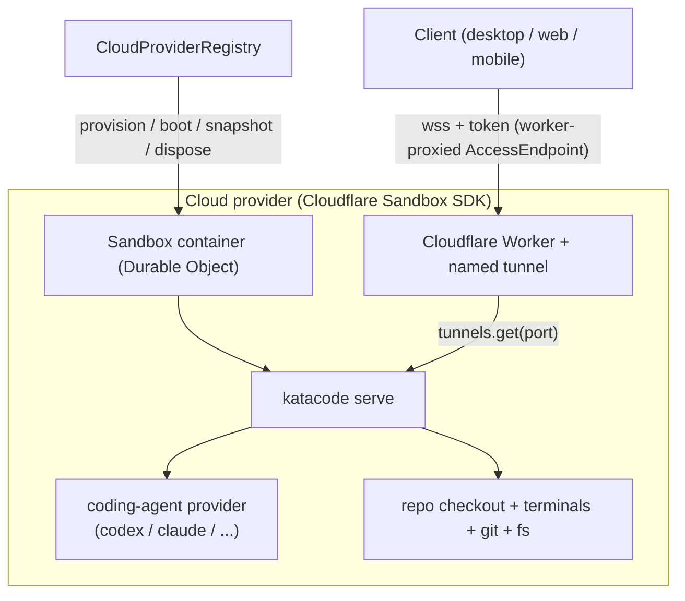

# Kata Cloud roadmap

## Status

Draft (revised 2026-06-27: V1 driver switched from Vercel to Cloudflare — see Key decisions 4–5 and the Cloudflare rationale section).

## Goal

Let users run Kata Code projects in the cloud the way they run them locally. A user
configures a **cloud provider** in Settings (the same mental model as adding an AI
provider), sets up a per-repo **environment** (Cursor-style: agent-driven, manual, or
both), and from the composer **starts a project in the cloud** or **moves a project to
the cloud and back**. When a project goes to the cloud, its environment is provisioned
automatically from that repo's environment configuration.

This document is the master roadmap. It establishes the architecture and breaks the work
into seven independently shippable phases, each with its own goal, requirements, and
acceptance criteria. Detailed implementation specs are authored per phase at build time.

This roadmap is deliberately high-level. It commits to architecture, boundaries, phase
sequencing, and acceptance criteria. It does not commit to exact APIs, file-by-file
plans, or UI pixel specs; those belong in per-phase specs.

## Source of truth

- Existing remote architecture: [remote.md](/architecture/remote.md) — `ExecutionEnvironment`,
  `AccessEndpoint`, `AdvertisedEndpoint`, launch vs access separation.
- Existing provider-instance pattern: [providers.md](/architecture/providers.md),
  `packages/contracts/src/providerInstance.ts`, `packages/contracts/src/settings.ts`
  (`providerInstances`, driver-specific settings, `ProviderInstanceConfig` envelope).
- Cloudflare Sandbox SDK docs: <https://developers.cloudflare.com/sandbox/> (RPC transport,
  tunnels API, sessions, snapshots). The June 2026 deprecation of `exposePort()` and
  HTTP/WebSocket transports in favor of RPC + the tunnels API is reflected in Key decision 5;
  see the [deprecation guide](https://developers.cloudflare.com/sandbox/guides/2026-deprecation/).
  Vercel skills (vendored under `.agents/skills/`): `vercel-sandbox`, `vercel-cli-with-tokens`,
  `deploy-to-vercel` — kept as reference for the future Vercel driver, not V1.
- Cursor cloud environment model: <https://cursor.com/docs/cloud-agent/setup>
  (resolution order, `install`/`start`/`terminals`, snapshots, agent-driven setup, secrets).
- Prior art — AgentBox (`madarco/agentbox`, MIT, local checkout at `/Volumes/EVO/repos/agentbox`):
  a working multi-provider implementation that runs an agent box across Vercel Sandbox,
  Hetzner, Daytona, and E2B behind **one** `CloudBackend` SPI composed once by
  `createCloudProvider(backend)`. Directly validates the capability-based driver design in
  this roadmap. Study its `packages/core/src/cloud-backend.ts` (the SPI),
  `packages/sandbox-cloud/src/cloud-provider.ts` (the scaffolding), and
  `packages/sandbox-{vercel,hetzner}/src/backend.ts` (two reachability models). Treat it as a
  pattern reference; do not import or copy code (per AGENTS.md reference-repo policy).
- UI reference comps (`docs/comps/cursor-cloud/`):
  - `SCR-20260627-hpes.png` — composer "Run on" dropdown (This Mac / Cloud / Worktree). Maps to Phase 4.
  - `SCR-20260627-hpyw.png` — Cloud Agents settings: Environments table, Defaults (branch prefix), Secrets. Maps to Phases 1–2.
  - `SCR-20260627-hqeu.png` — Environment detail: Snapshot ID, Update Script, network access, Secrets, "Start Setup Agent", Setup Runs/History. Maps to Phases 2, 5, 6.

  Treat the comps as interaction and information-architecture references, not as
  pixel-exact targets. Kata branding and existing Settings/composer styling win on conflict.

## Key decisions (locked during planning)

1. **Cloud runtime model — full Kata server in the sandbox.** When a project goes to the
   cloud, `katacode serve` runs inside the sandbox VM and the client connects to it as a
   remote `ExecutionEnvironment` over `wss`. Agents, terminals, git, and filesystem all run
   cloud-side. Cloud is a new **launch method** + **access endpoint**, not a new runtime.
   This reuses the entire existing remote/provider/orchestration stack.

2. **Lifecycle — ephemeral VM + snapshot reuse.** Each cloud session boots a fresh VM from
   a saved base snapshot (dependencies pre-baked), runs an idempotent `install` command,
   exposes its port, then disposes on idle/timeout. Work is preserved via git branch sync,
   not durable disk.

3. **Environment config home — repo file with saved-env fallback.** Resolution order:
   `.kata/environment.json` in the repo → saved per-repo environment in Settings → provider
   base-image default. Committable and team-shareable; authored manually, by agent, or both.

4. **Modularity — one capability-based cloud-provider SPI.** A single `CloudProvider` driver
   SPI mirrors the existing provider-instance pattern (open driver-kind slug, envelope config
   in a settings map, runtime registry, per-driver package) and follows AgentBox's proven
   shape: a small set of **required** primitives (`validate`, `provision`, `exec`,
   `reachability`, `dispose`, `describe`) plus **optional** capabilities a driver may omit
   (`createSnapshot`/`deleteSnapshot`/`snapshotExists`, `renewTimeout`, `signedPreviewUrl`,
   `networkPolicy`, and lifecycle pause/resume where the provider supports it). The registry
   degrades gracefully when a capability is absent. `describe()` advertises which capabilities
   and which reachability kind a driver supports. This is **not** two separate lifecycle
   archetypes; ephemeral behavior is the default and persistence is out of scope for V1. The
   canonical required/optional split is defined in the Architecture “CloudProvider driver SPI
   (shape)” section below. Cloudflare is the first driver; Hetzner, DigitalOcean, Vercel,
   Daytona, and E2B (plus a future Kata Agent driver) plug into the same SPI later.

5. **Reachability — a capability axis on the SPI; V1 uses `worker-proxied` via Cloudflare
   Tunnel.** Each driver declares a reachability kind:
   - `worker-proxied` (Cloudflare Sandbox SDK) — **V1.** Reachability is via the Sandbox SDK
     **tunnels API** (`sandbox.tunnels.get(port)`), which yields a public URL for an in-sandbox
     port. Quick tunnels (`*.trycloudflare.com`) for dev; **named tunnels** for production on a
     Cloudflare zone the operator already controls. The client connects over `wss` with the
     existing WebSocket auth token. (The older `exposePort()` + `proxyToSandbox()` + wildcard-
     DNS path was deprecated by Cloudflare in June 2026 in favor of the tunnels API; this roadmap
     targets tunnels from the start.)
   - `public-route` (Vercel) — sandbox exposes the Kata server port via a native public HTTPS
     route; client connects over `wss` with the existing WebSocket auth token. Future driver.
   - `ssh-tunnel` (Hetzner, DigitalOcean) — no public URL; reachability is an SSH ControlMaster +
     `ssh -L` forward, reusing the **desktop-managed SSH access method** already described in
     [remote.md](/architecture/remote.md). Reduced hosted-web support (needs a desktop host to
     own the forward).
     V1 implements only `worker-proxied`. Other kinds are modeled now so later drivers are not a
     retrofit, but are not built in this roadmap.

6. **Agent credentials — injected secrets, per session.** Provider auth (e.g.
   `ANTHROPIC_API_KEY`, Codex API key) and repo env secrets are stored in Kata settings and
   injected as environment variables into the sandbox at boot. No OAuth session forwarding in
   V1. **Secret-storage mechanism is an open decision** (see Phase 1): the current settings
   store persists secrets in plaintext (e.g. `OpenCodeSettings.serverPassword` is documented
   "stored in plain text on disk"), and no encryption-at-rest module exists in the codebase
   today. Phase 1's spec must choose the storage bar before AC-1.1 is gradeable.

7. **Move semantics — git branch sync, commit-based.** Move-to-cloud commits WIP to a
   `kata/cloud/<id>` working branch when dirty, then clones in the sandbox. Move-back pushes
   from the sandbox and fetches locally. Git is the sync transport; WIP handling is explicit.

## Relationship to Kata Code Connect

"Kata Cloud" (this roadmap) and "Kata Code Connect" ([docs/cloud/index.md](/cloud/index.md))
are distinct:

- **Kata Code Connect** is the existing hosted **relay + Clerk auth + pairing** layer
  (`infra/relay/`, `KATACODE_CLERK_*`). It helps a client _reach_ a Kata server across NAT
  and authenticates hosted-web pairing. It is a transport/control-plane concern.
- **Kata Cloud** is **where a Kata server runs**: a sandbox VM provisioned and booted by a
  cloud-provider driver. It is a launch concern.

They compose. Kata Cloud's V1 reachability standardizes on the sandbox tunnel URL
(`worker-proxied`) + `wss` token (Key decision 5). The Connect relay is the intended **future
reachability fallback** when direct tunnel reachability is unsuitable (e.g. private-network
egress); it is not implemented in this roadmap. To avoid clobbering the existing `docs/cloud/`
bundle, Kata Cloud docs live at `docs/architecture/cloud-sandbox.md` and
`docs/guides/cloud-sandbox/*`.

## Why Cloudflare for V1

V1 uses the Cloudflare Sandbox SDK rather than Vercel Sandbox. The deciding factor is
**consolidation on the operator's existing Cloudflare stack**: the project already runs a
Cloudflare zone and Workers for Kata Code Connect, so the reachability prerequisite for
Cloudflare (a Worker + a named tunnel on an operator-controlled zone) is infrastructure that
already exists rather than new surface to stand up. Adding Vercel would mean a second
provider dashboard, billing relationship, and auth flow for what is conceptually one cloud
surface.

Cost/performance tradeoffs (verified from both providers' docs, 2026-06-27):

- **Cost:** Cloudflare bills per second with scale-to-zero on a Workers Paid floor ($5/mo);
  Vercel has a free Hobby tier (5 hrs active CPU + 420 GB-hrs memory/mo included) then per-use on
  Pro. Cloudflare is cheaper per unit at low/intermittent volume; Vercel can cost nothing for
  light use. For a product in active development the consolidation argument outweighs the free
  Hobby tier.
- **Performance:** Vercel gives a full Firecracker microVM with root (can run Docker/FUSE/VPN)
  and larger max instances (up to 32 vCPU/64 GB), but is single-region (`iad1`) and caps Hobby at
  45 min runtime. Cloudflare runs a Linux container (less privileged, smaller max) but is
  globally distributed and fits scale-to-zero intermittent agent use.

Cloudflare's June 2026 deprecation of `exposePort()` and HTTP/WebSocket transports in favor of
RPC transport + the tunnels API is a focused, documented migration with a stable forward path,
not instability — this roadmap targets RPC + tunnels from the start (Key decision 5).

Vercel remains the simplest future driver (`public-route`, native public URL, no Worker/DNS
prerequisite) and is revisited if consolidation priorities change.

## Architecture

### Cloud is a launch + access concern

The existing remote architecture already separates three concerns:

- **`ExecutionEnvironment`** — one running Kata server (owns providers, projects, threads,
  terminals, git, fs).
- **Launch method** — how a Kata server comes to exist on a target machine.
- **Access method / `AccessEndpoint`** — how the client speaks WebSocket to that server.

Kata Cloud adds:

- a new **launch method** `cloudflare-sandbox` (provision sandbox container, boot `katacode serve`), and
- a new **`AccessEndpoint` kind** `worker-proxied` (Cloudflare Worker + named tunnel → `wss`).

The cloud server is otherwise an ordinary `ExecutionEnvironment`. Threads, orchestration,
checkpoints, and the React UI need no provider-specific cloud paths.



### Package layout (modular by design)

| Package                     | Role                                                                                                                                                                                                         | Notes                                                                                                                      |
| --------------------------- | ------------------------------------------------------------------------------------------------------------------------------------------------------------------------------------------------------------ | -------------------------------------------------------------------------------------------------------------------------- |
| `packages/cloud-contracts`  | Schema-only contracts: `CloudProviderDriverKind`, `CloudProviderInstanceId`, `CloudProviderInstanceConfig` envelope, `EnvironmentConfig` (`.kata/environment.json` schema), `CloudSessionState`, RPC shapes. | Mirrors `packages/contracts` discipline: no runtime logic; open driver-kind slug; unknown drivers round-trip without loss. |
| `packages/cloud`            | Driver SPI, `CloudProviderRegistry`, environment-config resolver, session lifecycle orchestration, snapshot cache policy. Provider-agnostic.                                                                 | Consumed by `apps/server` and (later) Kata Agent.                                                                          |
| `packages/cloud-cloudflare` | The Cloudflare Sandbox SDK driver implementing the SPI via `@cloudflare/sandbox` (RPC transport, tunnels API).                                                                                               | First and only V1 driver.                                                                                                  |
| `apps/server`               | Wires the registry into server layers; exposes `cloud.*` RPC methods; owns secret storage/injection and git branch sync.                                                                                     | No Cloudflare-specific logic beyond registration.                                                                          |
| `apps/web`                  | Settings UI for cloud providers + environments; composer "Run on" control; cloud session status.                                                                                                             | Reuses provider-settings form rendering where possible.                                                                    |

The CloudProvider driver SPI intentionally parallels `ProviderDriver`: a factory keyed by
an open `CloudProviderDriverKind` slug, configured by an envelope in a
`cloudProviderInstances` settings map, materialized by a registry that downgrades unknown
drivers to "unavailable" rather than crashing. The `packages/cloud` (scaffolding) +
`packages/cloud-cloudflare` (driver) split mirrors AgentBox's `sandbox-cloud` +
`sandbox-<provider>` layout, where shared seeding/lifecycle/URL logic lives once in the
scaffolding and each provider is “~one file implementing the backend.”

### CloudProvider driver SPI (shape, not final API)

Follows AgentBox's `CloudBackend` shape: required primitives every driver implements, plus
optional capabilities a driver may omit (the registry checks presence and degrades
gracefully). Required:

- `validate(config)` — credential/connectivity check ("Test connection").
- `provision(envConfig, secrets)` — create/boot a VM, apply base image/snapshot, run `install`.
- `exec(handle, cmd)` — run a command in the VM.
- `reachability(handle, port)` — resolve how the client reaches the Kata server port, per the
  driver's declared reachability kind (`public-route` URL, `ssh-tunnel` forward, or
  `worker-proxied` URL).
- `dispose(handle)` — tear down the VM.
- `describe()` — capabilities, reachability kind, and limits (max lifetime, supported base
  images, which optional capabilities below are available).

Optional capabilities (driver may omit):

- `createSnapshot` / `deleteSnapshot` / `snapshotExists` — VM snapshot lifecycle (Phase 5).
- `renewTimeout(handle)` — extend session before idle/timeout death for active work.
- `signedPreviewUrl` — browser-bound signed URL where the route model needs one.
- `networkPolicy` — native egress control (drivers without it may enforce via firewall).

Exact method signatures are frozen in Phase 0's per-phase spec before `cloud-cloudflare` work
begins (see Phase 0 requirements).

### Environment configuration (`.kata/environment.json`)

Modeled on Cursor's `environment.json`. Indicative shape:

```jsonc
{
  "build": { "dockerfile": ".kata/Dockerfile", "context": ".." }, // optional
  "snapshot": "snapshot-...", // optional
  "install": "pnpm install", // idempotent
  "start": "", // optional long-lived processes
  "terminals": [], // optional named app processes
}
```

Resolution order (first match wins): repo `.kata/environment.json` → saved environment in
Settings (keyed by `RepositoryIdentity` canonical key, not raw path, so local and remote
clones of the same repo share config) → provider base-image default. Secrets are never stored
in the repo file; they live in Kata settings and are injected as env vars.

## Phases

Each phase has a goal, requirements, and acceptance criteria. Phases 0–4 form the usable V1
spine; 5–6 add Cursor-parity polish. Phases are ordered by dependency; later phases assume
earlier ones landed.

### Phase 0 — Cloud-provider foundations (SPI + contracts)

**Goal.** Establish the modular cloud-provider substrate with no user-facing surface.

**Requirements.**

- Create `packages/cloud-contracts` with: open `CloudProviderDriverKind` slug,
  `CloudProviderInstanceId`, `CloudProviderInstanceConfig` envelope (driver + opaque config
  - optional displayName/enabled), `EnvironmentConfig` schema, and `CloudSessionState`.
- Create `packages/cloud` with the driver SPI interface and a `CloudProviderRegistry` that
  materializes instances from a settings map and marks unknown drivers unavailable.
- Add a `cloudProviderInstances` map to `ServerSettings` (mirrors `providerInstances`),
  parsing unknown drivers without loss.
- Ship a stub/in-memory driver used only by tests (not registered in production).
- **Cloudflare feasibility spike (gates Phase 3).** Verify against the live `@cloudflare/sandbox`
  API (RPC transport + tunnels): (a) `sandbox.tunnels.get(port)` yields a reachable public URL,
  (b) a sustained `wss` upgrade through that tunnel (quick tunnel for dev, named tunnel for
  production), and (c) the actual maximum sandbox lifetime. Record the verified API surface and
  limits; correct this roadmap's lifetime figure to the measured value.
- **Freeze the driver SPI method signatures** before `cloud-cloudflare` implementation begins.

**Acceptance criteria.** (see numbered global list below: AC-0.1 … AC-0.5)

### Phase 1 — Settings: add & configure the Cloudflare cloud provider

**Goal.** A user adds and configures a Cloudflare cloud provider in Settings, like an AI provider.

**Requirements.**

- Implement `packages/cloud-cloudflare` `validate`/`describe` against `@cloudflare/sandbox`
  (RPC transport) using Cloudflare account/zone credentials. The driver assumes the operator
  already runs a Cloudflare zone + Worker for Connect; production reachability uses a **named
  tunnel** on that zone, dev uses a quick tunnel (`*.trycloudflare.com`).
- Settings UI lists cloud providers, supports add/edit/remove of a Cloudflare instance, and
  stores credentials as out-of-band secrets (via the reused `ServerSecretStore` path).
- "Test connection" provisions a minimal sandbox and disposes it, reporting success/failure.
- Information architecture references comp `SCR-20260627-hpyw.png` (Environments table,
  Defaults such as branch prefix, Secrets list with per-repo scope).

**Acceptance criteria.** AC-1.1 … AC-1.4

### Phase 2 — Manual environment configuration & execution

**Goal.** Per-repo `.kata/environment.json` is resolved, executed in a sandbox, and secrets
are injected — all manually authored.

**Requirements.**

- Implement the resolver (repo file → saved env → provider default).
- Execute `install` (idempotent) and optional `start`/`terminals` in a booted sandbox.
- Inject Kata-stored secrets (provider auth + repo env secrets) as environment variables.
- Settings UI to view/edit a repo's saved environment (Update Script editor, network-access
  control, secrets) referencing comps `SCR-20260627-hqeu.png` and `SCR-20260627-hpyw.png`.

**Acceptance criteria.** AC-2.1 … AC-2.5

### Phase 3 — Cloud session boot + connect

**Goal.** Boot `katacode serve` inside the sandbox and reach it as a remote
`ExecutionEnvironment` over `wss`.

**Depends on the Phase 0 Cloudflare spike (AC-0.5) passing.** If the spike shows
worker-proxied `wss` is unworkable, this phase re-plans onto the Connect relay fallback
before proceeding.

**Requirements.**

- Launch method `cloudflare-sandbox`: provision/boot a sandbox container, install Kata server,
  start `katacode serve`.
- Access endpoint `worker-proxied`: expose the server port via `sandbox.tunnels.get(port)`;
  connect over `wss` (quick tunnel for dev, named tunnel on the operator's zone for
  production) with the required WebSocket auth token.
- The cloud server appears in the client as an `ExecutionEnvironment`; an agent turn,
  terminal command, and git/fs operation all execute cloud-side.
- Explicit failure surfaces for provision/boot/connect (no silent fallback to local).

**Acceptance criteria.** AC-3.1 … AC-3.5

### Phase 4 — Composer: start in cloud & move to/from cloud

**Goal.** From the composer, start a project in the cloud or move a project local↔cloud, with
the environment provisioned automatically from its repo config.

**Requirements.**

- Composer "Run on" control (This Mac / Cloud / Worktree) per comp `SCR-20260627-hpes.png`.
- "Start in cloud": provision a cloud env from the resolved repo environment config and open
  a thread bound to it.
- "Move to cloud": commit WIP to `kata/cloud/<id>` when dirty, push, clone in sandbox, bind.
- "Move back": push from sandbox, fetch locally, restore working branch.
- Cloud session status (provisioning/ready/error/disposed) surfaced in the UI.

**Acceptance criteria.** AC-4.1 … AC-4.7

### Phase 5 — Snapshot save & reuse

**Goal.** Cache a VM snapshot after setup so subsequent boots are measurably faster, with safe
fallback.

**Requirements.**

- Capture a snapshot after a successful `install` and persist its id with the saved env
  (Snapshot ID surfaced per comp `SCR-20260627-hqeu.png`).
- Boot subsequent sessions from the snapshot; re-run idempotent `install` to repair drift.
- Fallback to the base image when a snapshot is expired/invalid/inaccessible, with a warning
  surfaced (not a hard failure).

**Acceptance criteria.** AC-5.1 … AC-5.4

### Phase 6 — Agent-driven environment setup

**Goal.** An agent provisions the environment interactively, verifies it, then writes
`.kata/environment.json` and saves a snapshot — the recommended Cursor flow.

**Requirements.**

- "Start Setup Agent" boots a base sandbox and runs an agent session in a shared terminal to
  install dependencies and verify the build/tests.
- On success, the agent writes/updates `.kata/environment.json` (proposing a commit) and a
  snapshot is saved.
- Setup runs/history are viewable (per comp `SCR-20260627-hqeu.png` tabs).

**Acceptance criteria.** AC-6.1 … AC-6.4

## Acceptance criteria

Each criterion is observable via a test, command, API response, or manual UAT step. Phase
specs may add finer criteria but must not weaken these.

**Phase 0 — Foundations**

1. **AC-0.1** `packages/cloud-contracts` and `packages/cloud` build and pass `vp run typecheck`;
   `vp check` is clean.
2. **AC-0.2** Decoding a `cloudProviderInstances` map that contains an unknown driver kind
   succeeds and round-trips the envelope without data loss (unit test).
3. **AC-0.3** `CloudProviderRegistry` resolves a registered stub driver to an available
   instance and marks an unknown-driver instance "unavailable" without throwing (unit test).
4. **AC-0.4** No production driver is registered yet; server boots unchanged with the new
   settings field present and empty.
5. **AC-0.5** The Cloudflare feasibility spike produces a recorded result confirming (or
   refuting) (a) `sandbox.tunnels.get(port)` yields a reachable public URL, (b) sustained `wss`
   through that tunnel (quick tunnel for dev, named tunnel on an operator zone for production),
   and (c) the measured max sandbox lifetime, with the verified `@cloudflare/sandbox` API
   surface (RPC transport + tunnels) cited. A refutation blocks Phase 3 until reachability is
   re-planned.

**Phase 1 — Settings: Cloudflare provider** 6. **AC-1.1** A user can add a Cloudflare cloud provider instance in Settings, supplying
account/zone credentials, and the credentials persist via the secret-storage bar chosen in
the Phase 1 spec. If that bar is encryption-at-rest, a test asserts no plaintext credential in
the settings file; if the bar is plaintext-with-redaction (matching today's provider settings
via the reused `ServerSecretStore` path), a test asserts the value is redacted in API
responses and logs. The chosen bar is recorded in the Phase 1 spec before this AC is graded. 7. **AC-1.2** "Test connection" provisions a real sandbox and disposes it, returning a
visible success result; invalid credentials return a visible, specific failure (manual UAT

- e2e where feasible).

8. **AC-1.3** The cloud provider list renders add/edit/remove following the IA of comp
   `SCR-20260627-hpyw.png` (Environments/Defaults/Secrets sections present).
9. **AC-1.4** Removing a provider instance tears down stored credentials and the instance no
   longer appears in selection surfaces.

**Phase 2 — Manual environment config** 10. **AC-2.1** Given a repo with `.kata/environment.json`, the resolver selects it over a
saved env and over the provider default; the saved env is keyed by `RepositoryIdentity`
canonical key (unit test covering all three orderings and the key derivation). 11. **AC-2.2** Running setup in a booted sandbox invokes the `install` command; re-invoking it
unchanged on the same sandbox succeeds, and a non-zero exit surfaces as an explicit error
(integration/UAT). User-script idempotency is documented as the user's responsibility, not
asserted by Kata. 12. **AC-2.3** When `start`/`terminals` are configured, the corresponding processes appear in
the sandbox process list; when the config sets are empty, the launcher reports the empty
set and no corresponding process appears. 13. **AC-2.4** Kata-stored secrets are injected as environment variables visible to the
`install`/`start` commands; secret values are not written to the repo and are redacted in
logs. 14. **AC-2.5** The saved-environment editor (Update Script, network access, secrets) persists
edits and reflects them on next boot, per comps `SCR-20260627-hqeu.png` / `hpyw.png`.

**Phase 3 — Boot + connect** 15. **AC-3.1** Launching `cloudflare-sandbox` boots `katacode serve` inside the sandbox
container and the server becomes reachable on its exposed port via a tunnel
(integration/UAT). 16. **AC-3.2** The client connects to the sandbox over `wss` (quick tunnel for dev, named
tunnel for production) using the required auth token; an unauthenticated connection is
rejected. 17. **AC-3.3** The cloud server appears as an `ExecutionEnvironment` in the client and a coding
agent turn completes cloud-side (manual UAT; e2e where feasible). 18. **AC-3.4** A terminal command and a git operation (e.g. status/commit) execute inside the
sandbox and reflect in the UI. 19. **AC-3.5** Provision/boot/connect failures surface explicit errors; the client does not
silently fall back to a local environment.

**Phase 4 — Composer start/move** 20. **AC-4.1** The composer "Run on" control offers This Mac / Cloud (and existing Worktree)
per comp `SCR-20260627-hpes.png`. 21. **AC-4.2** "Start in cloud" provisions a cloud env from the resolved repo environment
config and opens a thread bound to that environment. 22. **AC-4.3** "Move to cloud" with a dirty working tree commits WIP to `kata/cloud/<id>`,
pushes, and clones in the sandbox; the cloud checkout contains the WIP commit. If the repo
has no writable push remote, the move is blocked with an explicit error before any teardown
of local state. 23. **AC-4.4** "Move back" pushes from the sandbox and fetches locally so the local branch
contains cloud-side commits. 24. **AC-4.5** Cloud session status (provisioning/ready/error/disposed) is visible in the UI
and updates on state change. 25. **AC-4.6** Disposing/idle-timing-out a cloud session releases the VM and surfaces the
disposed state without data loss of pushed commits. 26. **AC-4.7** Disposal/idle-timeout with un-pushed cloud-side WIP either auto-commits and
pushes to `kata/cloud/<id>` before teardown, or surfaces an explicit blocking warning that
requires user action before the VM is released. WIP is never discarded silently.

**Phase 5 — Snapshots** 27. **AC-5.1** A snapshot is captured after a successful `install` and its id is persisted with
the saved environment (visible per comp `SCR-20260627-hqeu.png`). 28. **AC-5.2** A subsequent session boots from the snapshot at least 50% faster than the first
cold boot for the same repo; both timings are recorded in UAT. (The 50% target may be
revised in the Phase 5 spec against measured cold-boot baselines.) 29. **AC-5.3** Booting from the snapshot still re-invokes `install` unchanged to repair drift,
surfacing a non-zero exit as an explicit error. 30. **AC-5.4** An expired/invalid/inaccessible snapshot falls back to the base image with a
visible warning and a successful boot (not a hard failure).

**Phase 6 — Agent-driven setup** 31. **AC-6.1** "Start Setup Agent" boots a base sandbox and runs an agent session whose
progress is visible in a shared terminal. 32. **AC-6.2** On a successful setup, the agent writes/updates `.kata/environment.json` and
proposes a commit containing it. 33. **AC-6.3** A snapshot is saved at the end of a successful agent-driven setup and is reused
on the next boot (ties to AC-5.2). 34. **AC-6.4** Setup runs/history are viewable per comp `SCR-20260627-hqeu.png`; a failed setup
surfaces logs and does not write a broken config.

## Sequencing

- **Hard order:** 0 → 1 → 2 → 3 → 4. Each depends on the prior.
- **5** depends on 2 (needs `install` execution) and is best validated after 3.
- **6** depends on 2, 3, and 5 (agent setup writes config and saves a snapshot).
- Parallelizable within a phase: contracts/SPI work (Phase 0) can proceed alongside Cloudflare
  driver scaffolding (Phase 1) once the SPI interface is frozen.

## Constraints

- Reuse the existing `ExecutionEnvironment` / launch / access model; do not fork the runtime
  for cloud.
- Mirror the provider-instance pattern (open driver-kind slug, envelope config, registry,
  graceful unknown-driver downgrade). Contracts packages stay schema-only.
- Required WebSocket auth token (the existing Kata server token, not a Cloudflare token) for any
  cloud (publicly reachable) environment.
- Secrets never committed to repos; never logged in clear text. At-rest storage bar (encrypted
  vs plaintext-with-redaction) is decided in the Phase 1 spec; today's settings store secrets
  in plaintext, so an encryption requirement implies new infrastructure scoped to that phase.
- Fail loud: provision/boot/connect/setup failures surface explicit errors, never silent
  fallback to local execution.
- Honor fork branding/identity: `.kata/` config dir, `kata/cloud/<id>` branch prefix,
  `KATACODE_*` env, `~/.katacode` state. No upstream `t3`/`cursor` product strings in Kata
  surfaces.

## Out of scope (deferred to later specs)

- **Other cloud drivers.** The capability-based SPI must accommodate them; this roadmap
  implements only Cloudflare (reachability `worker-proxied` via tunnels). Future drivers, tagged
  by reachability kind and snapshot capability (AgentBox proves all of these behind one SPI):
  - **Vercel Sandbox** — `public-route`; native public preview route, Firecracker microVM with
    root, free Hobby tier (5 hrs active CPU/mo included) for light use. **Simplest future
    driver**; deferred only because V1 consolidates on the operator's existing Cloudflare stack.
  - **Hetzner** — `ssh-tunnel`; **ephemeral-capable** (per-box VPS from a base snapshot via
    cloud-init; `create_image` snapshots; `destroy` deletes server + firewall). Reduced
    hosted-web support (desktop-managed SSH forward).
  - **DigitalOcean** — `ssh-tunnel`; droplet from snapshot via `POST /v2/droplets` +
    cloud-init. Same class as Hetzner.
  - **Daytona / E2B** — `public-route` + snapshot-capable; close analogues of the Vercel path.
- **Persistent cloud workspaces / durable disk.** V1 is ephemeral + snapshot reuse only.
  Ephemerality is the SPI default, not a per-provider trait — Hetzner/DO are ephemeral-capable
  under this model, not persistent-only.
- **Multi-repo environments / repo groups.** V1 scopes one repo per cloud environment.
- **OAuth/session forwarding for provider auth.** V1 uses injected API-key/token secrets;
  OAuth forwarding is deferred future work, consistent with the credential decision.
- **Team/shared cloud environments, usage/billing dashboards, network egress allowlists** as
  full features (network-access control may appear as a stored setting in Phase 2 without a
  full enforcement engine).

## Risks and mitigations

- **Sandbox lifetime limits (unverified; vendored skill shows only 5-min example caps).** The
  true max VM lifetime is measured in the Phase 0 spike (AC-0.5); do not rely on a specific
  figure until then. Long agent runs may outlive a VM. Mitigation: surface remaining lifetime;
  rely on git branch sync so disposal never loses pushed work (AC-4.7); fast boot via snapshots
  (Phase 5).
- **Tunnel reachability / mixed content / feasibility (highest technical risk).** HTTPS
  hosted web must reach `wss`, and reachability depends on the Cloudflare Sandbox tunnels API
  (`sandbox.tunnels.get(port)`) which superseded the deprecated `exposePort()`. Mitigation: the
  Phase 0 spike (AC-0.5) verifies tunnels + `wss` against the live SDK and gates Phase 3; use
  quick tunnels for dev and named tunnels on the operator's existing zone for production; the
  existing Kata Code Connect relay is the documented re-plan fallback, not V1.
- **Secret handling.** Injecting provider/API secrets into a remote VM is sensitive, and the
  current settings store keeps secrets in plaintext. Mitigation: decide the at-rest bar in the
  Phase 1 spec; inject only at boot as env vars; never log; never commit; redact in API/logs;
  scope secrets per provider instance / per repo.
- **Cold-boot latency without snapshots.** First boot installs Kata server + deps.
  Mitigation: Phase 5 snapshots; pre-baked base image with Kata server.
- **Git WIP loss during move.** Mitigation: explicit auto-commit to `kata/cloud/<id>` before
  clone; never discard uncommitted changes silently.
- **SPI churn.** Freezing the SPI too late forces rework in `cloud-cloudflare`. Mitigation: lock
  the SPI interface in Phase 0's per-phase spec before Cloudflare driver implementation; validate
  the shape against AgentBox's `CloudBackend` (prior art) so the required/optional split is
  right the first time.

## Prior art / references

- **AgentBox** (`madarco/agentbox`, MIT; local checkout `/Volumes/EVO/repos/agentbox`). A
  working multi-provider agent-sandbox tool that runs across Vercel, Hetzner, Daytona, and E2B
  behind one `CloudBackend` SPI. Most relevant files to study before Phase 0:
  - `packages/core/src/cloud-backend.ts` — the SPI: required primitives + optional
    capabilities (`createSnapshot`, `renewTimeout`, `signedPreviewUrl`, volumes), which this
    roadmap's SPI mirrors.
  - `packages/sandbox-cloud/src/cloud-provider.ts` — `createCloudProvider(backend)`
    scaffolding: workspace/git seeding, snapshot/checkpoint restore with stale-snapshot
    fallback, credential injection, lifecycle re-ensure on wake.
  - `packages/sandbox-vercel/src/backend.ts` and `packages/sandbox-hetzner/src/backend.ts` —
    two reachability models (`public-route` vs `ssh-tunnel`) implementing the same SPI.
    Use as a pattern reference only; do not import or copy code (AGENTS.md reference-repo
    policy). It is a different product (multi-agent box runner, not a Kata `ExecutionEnvironment`
    host), so adapt rather than transplant.

## Verification (roadmap-level)

- Per-phase specs carry the detailed test plans. At minimum each phase must satisfy its ACs
  via: unit tests (contracts/resolver/registry), integration/UAT against a real Cloudflare
  sandbox (provision/boot/connect/install/snapshot), and Playwright Electron e2e for
  composer/settings flows where feasible (`vp run e2e`), tagged with a new `@cloud` feature
  tag.
- CI parity gates (`vp check`, `vp run typecheck`, `vp run test`, `vp run release:smoke`) must
  pass for every phase before completion (per AGENTS.md).

## Key files (anticipated, not exhaustive)

- New: `packages/cloud-contracts/src/*`, `packages/cloud/src/*`, `packages/cloud-cloudflare/src/*`.
- Edit: `packages/contracts/src/settings.ts` (`cloudProviderInstances`),
  `apps/server/src/serverLayers.ts` (registry wiring), `apps/server/src/wsServer.ts` /
  contracts `ws.ts` (`cloud.*` RPCs), `apps/server/src/provider`/remote launch + access glue.
- Web: `apps/web/src/components/settings/*` (cloud provider + environment panels),
  `apps/web/src/components/chat/Composer*` (Run-on control), cloud session status surfaces.
- Docs: new `docs/architecture/cloud-sandbox.md`, `docs/guides/cloud-sandbox/*`, update
  `docs/architecture/index.md`, `docs/specs/index.md` (do not clobber the existing
  `docs/cloud/` Kata Code Connect bundle).

## Build handoff

- **Approved scope:** seven phases above; Cloudflare-only (reachability `worker-proxied` via
  tunnels); one capability-based cloud SPI (required primitives + optional capabilities,
  AgentBox-shaped); ephemeral + snapshot; repo-file-first env config; full Kata server in sandbox
  reached via Worker + tunnel + token; injected secrets; git branch-sync move semantics.
- **Non-goals:** other drivers (Vercel/Hetzner/DO/Daytona/E2B), persistent disk, multi-repo,
  OAuth forwarding, billing. Vercel is the simplest future driver (`public-route`); Cloudflare is
  V1 per the consolidation rationale.
- **Required verification:** each phase's ACs + CI parity gates; `@cloud` e2e tag.
- **Blocking questions for Phase 0 spec:** final SPI method signatures; exact
  `.kata/environment.json` schema fields; secret-storage bar (encrypted vs
  plaintext-with-redaction) reused vs new; and the Phase 0 Cloudflare spike result (AC-0.5)
  confirming tunnel `wss` reachability before Phase 3 is planned.
