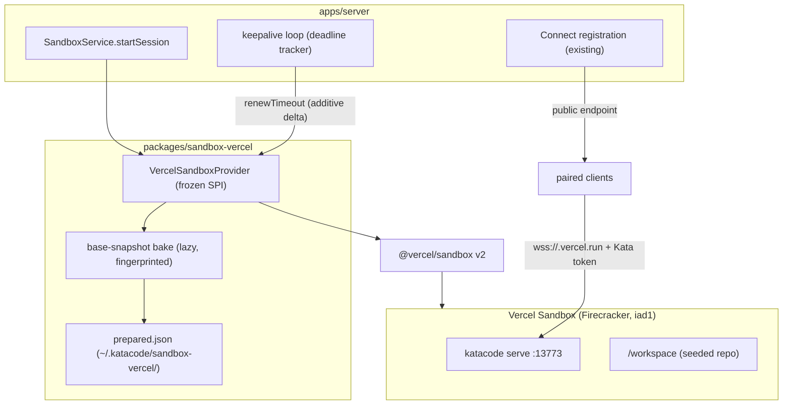

# Kata Environments / Deployments Phase 3 — Vercel cloud sandbox driver

## Status

Approved. The three open questions were resolved at approval (see Resolved questions).

This is the Phase 3 deep-dive (one spec per phase; see the
[roadmap](/specs/2026-06-27-kata-environments-deployments-design.md)). It implements roadmap
Phase 3 ("Cloud sandbox driver (Vercel, BYOC)") per
[ADR 0005](/adrs/0005-vercel-first-cloud-driver.md) and builds on the
[Phase 1](/specs/2026-06-27-kata-environments-deployments-phase-1-design.md) substrate (frozen
`SandboxProvider` SPI, registry, `sandbox.*` RPCs, Connect auto-registration) and the
[Phase 2](/specs/2026-06-27-kata-environments-deployments-phase-2-design.md) environment
pipeline (resolver, repo seeding via `copyInto`, `install`/`start`/`terminals`, secret
injection with redaction).

## Goal

A user configures a Vercel deployment target with their own credentials in Settings →
Environments, starts a session, and gets a Kata server running in a Vercel Sandbox microVM —
reachable from every paired client over `wss` through the sandbox's native public URL, with the
repo seeded and the environment config executed exactly as the container driver does it. The
driver handles Vercel's bounded session lifetime as a first-class concern: keepalive while
active, explicit lapse surfacing, resume on reconnect.

## Source of truth

- Master roadmap Phase 3 (amended 2026-07-03):
  [2026-06-27-kata-environments-deployments-design.md](/specs/2026-06-27-kata-environments-deployments-design.md)
  (AC-3.1 … AC-3.7).
- Driver-order decision: [ADR 0005](/adrs/0005-vercel-first-cloud-driver.md).
- Frozen SPI: `packages/sandbox/src/SandboxProviderDriver.ts` (`validate`/`provision`/`exec`/
  `reachability`/`dispose`/`describe`; optional `snapshot`/`renewTimeout`/`copyInto`
  capabilities; `SandboxProviderError` reasons). **Phase 3 adds no required member.**
- Descriptor: `packages/sandbox/src/descriptor.ts` (`maxLifetimeMs?`, `supportsSnapshot`,
  `supportsRenewTimeout`, `supportsCopyInto`).
- Server orchestration: `apps/server/src/sandbox/SandboxService.ts` (`startSession` provision →
  seed/setup → Connect registration; idempotency guard; `disposeAfterFailure`),
  `apps/server/src/sandbox/sandboxSetupRunner.ts`, `environmentConfigLoader.ts`.
- Secret infra: `apps/server/src/serverSettings.ts`
  (`materializeSandboxProviderEnvironmentSecrets`), `apps/server/src/auth/ServerSecretStore.ts`.
- Prior art (pattern reference only, per AGENTS.md reference-repo policy — adapt, don't
  transplant): AgentBox `/Volumes/EVO/repos/agentbox`
  - `packages/sandbox-vercel/src/backend.ts` — production driver: port merging, keepalive
    (`renewTimeout` via additive `extendTimeout`), snapshot retention guards, retry policy.
  - `packages/sandbox-vercel/src/prepare.ts` + `prepared-state.ts` — base snapshot bake and
    persisted bake state with context fingerprint.
  - `docs/vercel-sandbox-findings.md` — live-verified platform behavior (2026-05-28,
    `@vercel/sandbox@2.0.1`): `wss` over `sandbox.domain(port)`, SDK footguns, limits.
  - `docs/vercel-backlog.md`, `docs/cloud-providers.md` §3b — platform shape.

## Verified platform constraints (from AgentBox live findings)

| Constraint                                                                                   | Consequence for this design                                        |
| -------------------------------------------------------------------------------------------- | ------------------------------------------------------------------ |
| No custom images; snapshot-bake only                                                         | `provision` boots from a baked base snapshot (decision 2)          |
| `sandbox.domain(port)` is public HTTPS + WebSocket, stable across stop/start                 | Reachability is a direct `public` endpoint; no tunnel (AC-3.1/3.2) |
| Ports fixed at create; ≤4 exposed; none <1024                                                | The Kata serve port is in the create-time set; validated ≥1024     |
| Max session 45 min Hobby / 5 hr Pro+; `extendTimeout` additive; remaining time not readable  | Host-tracked deadline + keepalive loop (decision 4)                |
| Lapse ⇒ auto-snapshot on stop; `Sandbox.get({ resume: true })` resumes with fs intact (~18s) | Lapse/resume UX (decision 5)                                       |
| No nested containers (seccomp)                                                               | `EnvironmentConfig.build` fails loud on this driver (decision 6)   |
| Region `iad1` only                                                                           | Documented; no region config field in V1                           |
| Headless auth = access-token trio; OIDC can't refresh headlessly                             | Trio-only auth (decision 3)                                        |
| `Snapshot.get()` resolves deleted/failed snapshots (tombstones)                              | Gate all snapshot reuse on `status === "created"`                  |
| Fresh sandbox `currentSnapshotId === sourceSnapshotId`                                       | Never delete a snapshot that aliases the source                    |
| `list()`/`get()` disagree on stopped sandboxes (ghosts)                                      | Tolerate 404 on cleanup; never treat as fatal                      |

## Locked decisions

1. **`packages/sandbox-vercel` implements the frozen SPI; no SPI change.** Required members plus
   the optional capabilities Vercel supports: `renewTimeout` (via additive `extendTimeout`
   against a host-passed deadline delta), `snapshot`
   (`createSnapshot`/`deleteSnapshot`/`snapshotExists`, gated on `status === "created"` — also
   pre-wires Phase 5), and `copyInto` (upload the Phase 2 seed tar via the SDK file-write API,
   then `exec` a `tar -x` into the destination path — so the Phase 2 seeding pipeline works
   unchanged on this driver). `describe()` returns `reachabilityKind: "public"`,
   `supportsSnapshot: true`, `supportsRenewTimeout: true`, `supportsCopyInto: true`, and
   `maxLifetimeMs` from the configured plan ceiling.

2. **Base snapshot bake, lazy on first use.** Vercel cannot build images. The driver bakes a
   base snapshot once per (Kata CLI version × bake-script fingerprint): boot a fresh `node24`
   sandbox, install the published `@kata-sh/code-cli` (`npm i -g`), snapshot with
   `expiration: 0`, persist `{ snapshotId, cliVersion, contextSha256, createdAt }` in the server
   state dir (`~/.katacode/sandbox-vercel/prepared.json`, schema-versioned), then best-effort
   delete the builder sandbox (safe — snapshots are independent id-addressed resources). The
   bake runs lazily inside the first `provision` (and re-runs when the fingerprint changes or
   the persisted snapshot is no longer `status === "created"`), streaming progress through the
   existing test-connection/provision progress events. `validate` ("Test connection") checks
   credentials + API reachability only; it does not bake (a bake is minutes, not a check).

3. **Auth is the access-token trio via existing secret infra.** Driver config schema:
   `{ token, teamId, projectId, vcpus?, timeoutMs? }` with `token` declared `sensitive` so the
   existing `ServerSecretStore` + `valueRedacted` envelope applies unchanged (no new redaction
   path). OIDC is rejected with an explicit config error, not silently attempted.

4. **Session lifetime: host-tracked deadline + keepalive.** `provision` requests the configured
   `timeoutMs` (default 45 min — the Hobby ceiling, safe on all plans). `SandboxService` tracks
   the deadline per session and runs a keepalive loop while the session is registered: extend
   via `renewTimeout(handle, targetDeadline, currentDeadline)` → driver computes the additive
   delta (Vercel's remaining time is not readable). A plan-cap rejection is logged and surfaced;
   the session then lapses at the cap. Remaining lifetime is included in the session status
   payload the UI already renders (AC-3.6).

5. **Lapse is explicit, resume is manual.** When the sandbox hits its deadline, Vercel
   auto-snapshots and stops it. The server marks the session `error` with a distinct
   `lapsed` detail (surfaced in UI; a mid-turn agent stream fails with an explicit error — never
   a silent hang), deregisters it from Connect, and offers "Resume": `Sandbox.get({ resume:
true })` restores the filesystem, the driver restarts `katacode serve`, and the server
   re-registers with Connect. Automatic transparent resume is out of scope (a resumed server is
   a new process; provider sessions do not survive — same honesty bar as the V1 move semantics).

6. **`EnvironmentConfig.build` fails loud on this driver.** No nested containers on Vercel. If
   the resolved environment config carries a `build` field, `startSession` fails before
   provision with an explicit "not supported on this deployment target" error. `install`/
   `start`/`terminals` run unchanged via the Phase 2 setup runner (blocking `exec` + detached
   processes work on Vercel's `runCommand` semantics).

7. **Reachability + Connect reuse the Phase 1 path with a `public` endpoint.** `reachability`
   returns `{ reachabilityKind: "public", httpBaseUrl: https://<sandbox-domain>, wsBaseUrl:
wss://<sandbox-domain> }` from `sandbox.domain(port)`. The serve port (default 13773) is in
   the create-time exposed-port set. Connect registration and the per-session Kata bootstrap
   token are the existing `SandboxService.startSession` flow — unauthenticated connections are
   rejected by the Kata server exactly as on every other endpoint (AC-3.2).

8. **SDK calls get a bounded retry policy; billable calls don't retry ambiguously.**
   Mirror the AgentBox posture: `Sandbox.create` and `snapshot()` never retry on ambiguous
   failures (billable + non-idempotent); reads and idempotent lifecycle calls retry with
   backoff and per-attempt timeouts. All failures map to the existing
   `SandboxProviderError` reasons (fail loud, no silent local fallback — AC-3.5).

## Architecture

Provision sequence: resolve credentials → ensure base snapshot (bake if missing/stale/tombstoned)
→ `Sandbox.create({ source: snapshot, ports: [13773], timeout })` → inject env (secrets
materialized host-side, Phase 2 path) → start `katacode serve` → seed repo (`copyInto`) → run
setup (`install`, detached `start`/`terminals`) → `reachability` → Connect registration →
session `ready`, keepalive begins.

## Acceptance criteria

Roadmap AC-3.1 … AC-3.7 govern; this spec refines how each is proven.

- **AC-3.1** (boot + public URL): integration test with real credentials — provision boots
  `katacode serve`; `GET <httpBaseUrl>/<well-known descriptor>` succeeds.
- **AC-3.2** (`wss` + token): integration — a `wss` client with the bootstrap token completes a
  handshake; without it, the connection is rejected.
- **AC-3.3** (agent turn cloud-side): manual UAT (recorded), e2e where feasible.
- **AC-3.4** (Connect auto-registration): existing registration path; second-client reachability
  recorded as manual UAT (same standing rule as Phase 1's AC-1.11).
- **AC-3.5** (fail loud): unit tests — every SDK failure maps to a `SandboxProviderError`; no
  code path falls back to a local driver.
- **AC-3.6** (lifetime): unit tests for the deadline tracker + additive-delta computation;
  integration test that `extendTimeout` extends a live sandbox; lapse UX proven by provisioning
  with a short `timeoutMs` and observing the explicit `lapsed` state and Resume flow.
- **AC-3.7** (demo & e2e): settings/config validation e2e-automated under
  `@environments-deploy` (no credentials: add/edit/remove a Vercel target, secret redaction,
  `build`-field rejection); credentialed provision/boot slices e2e-automated where CI
  credentials exist, else recorded manual UAT with a live walkthrough.

## Test plan

- **Unit (no credentials):** config schema decode/reject (incl. OIDC rejection), exposed-port
  merging (≥1024, ≤4, serve port always present), additive-delta computation, snapshot
  usability gate (`status === "created"`), tombstone/alias/ghost footgun guards (mocked SDK),
  error mapping, descriptor capability flags (all-methods-present rule).
- **Integration (credentialed, free Hobby tier, maintainer-local or CI secret):** bake → boot →
  serve reachable → `wss` handshake → exec → seed → dispose; `extendTimeout` live; lapse with a
  short timeout; resume.
- **E2E (`@environments-deploy`):** settings CRUD + validation slices per AC-3.7. Credentialed
  slices are maintainer-local + recorded UAT (no CI secret; see Resolved questions).
- **Manual UAT (recorded):** cloud agent turn (AC-3.3), second-client Connect reachability
  (AC-3.4).
- CI parity gates (`vp check`, `vp run typecheck`, `vp run test`, `vp run release:smoke`) pass.

## Risks

- **Bake latency on first use** (minutes: fresh sandbox + `npm i -g` + snapshot). Mitigation:
  streamed progress through existing provision events; fingerprinted skip on subsequent boots;
  documented in the target card.
- **Published-CLI dependency.** The bake installs `@kata-sh/code-cli` from npm, so the sandbox
  server version tracks the latest published release, not the local build. Mitigation: record
  `cliVersion` in prepared state and surface it; a version-pinning config field is a fast
  follow if drift bites.
- **Keepalive vs plan caps.** Hobby sessions lapse at 45 min regardless of keepalive.
  Mitigation: `maxLifetimeMs` surfaced pre-start; remaining-lifetime countdown in status; lapse
  is explicit with one-click Resume.
- **SDK/platform drift** since the 2026-05-28 findings. Mitigation: the integration suite is
  the canary; footgun guards are defensive (tolerate fixed behavior).

## Key files

- New: `packages/sandbox-vercel/src/{index,config,VercelSandboxProvider,bake,preparedState,retry}.ts`
  (+ tests), `~/.katacode/sandbox-vercel/prepared.json` (state, not repo).
- Edit: `apps/server/src/sandbox/SandboxService.ts` (register driver; keepalive loop; lapse
  state + Resume; `build`-field guard), `apps/server/src/sandbox/sandboxSetupRunner.ts` (only
  if detached-process semantics need a Vercel variant), Settings UI driver picker
  (`apps/web/src/components/settings/SandboxDeploymentSettings.tsx`), e2e under `e2e/tests/`.
- Docs: `docs/architecture/environments-deploy.md` (driver matrix), this spec's build report.

## Resolved questions (2026-07-03 approval)

1. **CI credentials for the credentialed e2e slice** — maintainer-local + recorded UAT. No repo
   secret; the credentialed integration suite and UAT slices run against the maintainer's free
   Hobby team with evidence recorded per the standing rule. Revisit if a CI secret becomes
   worthwhile (tracked as deferred work if it does).
2. **Default `timeoutMs`** — 45 min (the Hobby ceiling, safe on all plans) with a per-target
   config override. No plan detection in V1.
3. **Resume affordance placement** — the deployment-target card owns the Resume action in V1;
   the session status surface renders the same `lapsed` state read-only.
