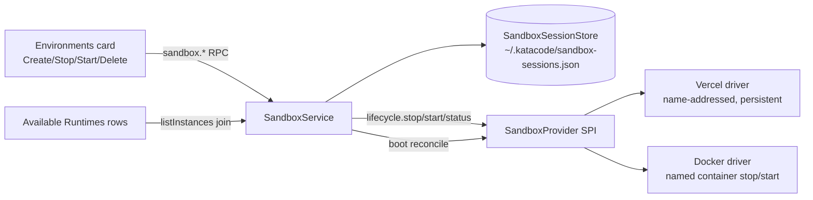

# Sandbox lifecycle — durable stop/start for Vercel and Docker

## Status

Draft

## Goal

Sandboxes behave like the stoppable/startable machines both providers actually offer. Today every "Start session" provisions a brand-new Vercel microVM or Docker container, dispose destroys everything, and a disposed sandbox leaves an orphaned Available Runtimes row that fails Connect with "Saved environment is missing its saved credential." For a large repo the re-provision path is expensive (Vercel bills data transfer for every re-seed).

After this work:

- **Vercel** uses SDK v2 persistent sandboxes: stop auto-saves the filesystem, start resumes it by name. No user-facing snapshot management.
- **Docker** stops and starts a named container instead of destroying and re-creating it.
- **Lifecycle state survives Kata server restarts** via a persisted session store reconciled against the provider on boot.
- **The UI says what it does**: `Create & run sandbox`, `Stop`, `Start`, `Delete sandbox` — no "Dispose", no vestigial Enabled toggle.
- **Available Runtimes rows reconcile** with lifecycle state instead of offering a Connect that cannot succeed.

## References

- [Phase 1 deep-dive](/specs/2026-06-27-kata-environments-deployments-phase-1-design.md) — frozen SPI (`packages/sandbox/src/SandboxProviderDriver.ts`); "later phases may add optional capabilities but must not change required signatures."
- [Phase 3b deep-dive](/specs/2026-07-04-kata-environments-deployments-phase-3b-design.md) — the Vercel driver this spec reworks (lapse/resume/snapshot model).
- [ADR 0007 — Vercel Sandbox first cloud sandbox driver](/adrs/0007-vercel-sandbox-first-cloud-sandbox-driver.md).
- Vercel Sandbox v2 persistence docs (verified 2026-07-07): persistence is the default for `Sandbox.create()`; stop auto-snapshots; `Sandbox.get({ name })` / any SDK call auto-resumes; `keepLastSnapshots: { count: 1 }` bounds snapshot storage; sandboxes are addressed by a project-unique `name`; `sandbox.update({ persistent })` toggles after creation; non-persistent sandboxes cannot be resumed. Installed SDK: `@vercel/sandbox@2.4.0`.

## Verified current state

- `packages/sandbox/src/SandboxProviderDriver.ts` — frozen SPI with optional `snapshot`, `renewTimeout`, `copyInto`, `resume` capabilities. No stop/start/status.
- `packages/sandbox-vercel/src/VercelSandboxProvider.ts` — provision always calls `sdk.create` (no `name`, so effectively an anonymous sandbox); `snapshot` capability stops the VM and returns an explicit `snapshotId` the user pastes into `config.snapshotId` with `sourceType: "snapshot"`; `resume` reattaches via `Sandbox.get({ sandboxId, resume: true })` and only works while the sandbox record still exists; `dispose` deletes the sandbox.
- `packages/sandbox-vercel/src/sdk.ts` — injectable wrapper over `@vercel/sandbox@2.4.0`. Already notes v2 addressing by `name`; the wrapper's `sandboxId` field carries `sb.name`. No `stop()`/persistence params surfaced in `create`.
- `packages/sandbox-docker/src/DockerSandboxProvider.ts` — provision = `POST /containers/create?name=…` + start; dispose = force `DELETE`. No stop/start; the container name is timestamped, not deterministic per instance.
- `apps/server/src/sandbox/SandboxService.ts` — `runningSessions` is an in-memory `Map` ("Phase 1; not durable"); a server restart orphans every running sandbox. Lapse/resume/snapshot RPC surface (Phase 3b) rides on this map. `disposeSession` returns `false` when no in-memory entry exists.
- `packages/contracts/src/sandboxRpc.ts` — `SandboxRunningSession.status: "running" | "lapsed"`, `lapsedReason`, `snapshotId`; RPCs `startSession`, `disposeSession`, `renewSession`, `resumeSession`, `createSnapshot`, provider-login.
- `apps/web/src/components/settings/SandboxDeploymentSettings.tsx` — card with `Start session` / `Dispose` / `Resume` / `Snapshot` / `Extend`, an Enabled toggle wired to `config.enabled` (which no sandbox code path reads), and client-side `activeSession` memory that `handleDispose` depends on to clean up the saved runtime record (misses sandboxes started elsewhere or before a reload).
- `apps/web/src/components/settings/ConnectionsSettings.tsx` — Available Runtimes rows (`SavedBackendListRow`) offer Connect/Disconnect against saved environment records; a stopped/deleted sandbox's record persists with a dead credential.

## Constraints

- The SPI freeze allows **adding optional capabilities**; required signatures must not change.
- **Fail loud**: no silent recreate of a gone sandbox, no swallowed reconcile errors.
- **No plaintext secrets in settings or the session store.** Admin tokens are re-minted on start via the existing pairing flow; the store holds only non-secret handle state.
- `Sandbox.create` (Vercel) is billable and non-idempotent — never retried (existing rule, preserved).
- Vercel credentialed paths are maintainer-local UAT; CI has no Vercel secret. Docker paths are automatable in `@environments-deploy` E2E.
- Keep behavior predictable across reconnects and server restarts (core priority: reliability).

## Out of scope

- Railway or any additional cloud driver.
- Per-sandbox Kata Connect registration toggles (deferred from the Environments UX pass).
- Composer "Run on" / thread-to-sandbox binding (Phase 4 of the roadmap).
- Multi-session-per-instance (one sandbox per instance id remains the invariant).

## Design

### 1. SPI: optional `lifecycle` capability

`packages/sandbox/src/SandboxProviderDriver.ts` gains:

```ts
export type SandboxLifecycleStatus = "running" | "stopped" | "gone";

export interface SandboxLifecycleCapability {
  stop(handle: SandboxHandle): Effect.Effect<void, SandboxProviderError>;
  start(
    handle: SandboxHandle,
    req: { readonly config: unknown; readonly env?: ReadonlyArray<readonly [string, string]> },
  ): Effect.Effect<SandboxHandle, SandboxProviderError>;
  status(handle: SandboxHandle): Effect.Effect<SandboxLifecycleStatus, SandboxProviderError>;
}
```

- `SandboxProvider` gets `readonly lifecycle?: SandboxLifecycleCapability`; `SandboxProviderDescriptor` gets `supportsLifecycle: boolean`.
- The existing `resume` capability is **removed from the SPI** — `lifecycle.start` subsumes it. (SPI amendment recorded here: `resume` was optional and Phase 3b-only; both call sites move to `lifecycle`.) `supportsResume` is **removed** from `SandboxProviderDescriptor` (`packages/sandbox/src/descriptor.ts`) and from the `SandboxInstanceSummary` contract; `supportsLifecycle` replaces it in both.
- The `snapshot` capability stays in the SPI (Docker may use it someday) but the Vercel driver stops exposing it and the server/UI surface for explicit snapshots is removed. `supportsSnapshot` **remains** in the descriptor and contract for future drivers and is `false` for both current drivers after this change.
- Contract semantics: `stop` on an already-stopped sandbox is idempotent success; `start` on a running sandbox is idempotent success (re-verifies serve + healthz); `start` on a `gone` sandbox fails `provision-failed` with a message telling the user to create a new sandbox; `status` never mutates.

### 2. Vercel driver: v2 persistent sandboxes

`packages/sandbox-vercel`:

- **Naming.** Provision derives a deterministic name: `kata-<instanceSlug>-<hash8>` where `hash8` is a stable hash of `(serverEnvironmentId, instanceId)` and the whole name is clamped to Vercel's name rules (lowercase alphanumeric + dashes; verify exact limit against the SDK during build). The name lives in handle state and makes rediscovery possible after a restart.
- **Creation.** `sdk.create` passes `name` and persistence per config. Config gains `persistent: boolean` (default `true`); when persistent, creation also sets `keepLastSnapshots: { count: 1 }` so snapshot storage stays flat. `sourceType` and `snapshotId` config fields are **removed**; runtime boot + bootstrap script is the only cold-boot path.
- **stop.** `sb.stop()`. Persistent → Vercel auto-snapshots. Non-persistent → the filesystem is discarded but the sandbox record still exists by `name`: `status` reports `stopped`, and `lifecycle.start` on a non-persistent stopped sandbox fails `provision-failed` with a message that the sandbox was not persistent and must be re-created (no silent recreate).
- **start.** `Sandbox.get({ name, resume: true })`, relaunch `katacode serve` detached, poll public healthz (existing `waitForReady`). Returns a refreshed handle (domain re-captured). The current config's `persistent` value is re-applied via `sandbox.update({ persistent })` on start, making the toggle effective at runtime (the next stop honors the new value).
- **status.** Resolve the sandbox without resuming it and map the SDK status to the SPI enum. SDK statuses (`@vercel/sandbox@2.4.0` `SessionMetaData["status"]`: `failed | aborted | pending | running | stopping | snapshotting | stopped`) map as: `running` ← `running`, `pending`; `stopped` ← `stopped`, `stopping`, `snapshotting`, `aborted`, `failed`; `gone` ← not-found. **Build-blocking spike (start of Phase 3):** verify whether `Sandbox.get({ name, resume: false })` returns a handle with readable status for a stopped sandbox or throws; if it throws, use `Sandbox.list` filtered by name (sandbox-level status, no session assumption). The injectable wrapper (`sdk.ts`) isolates whichever mechanism wins; the spike result is recorded in the build report before wider Phase 3 work proceeds.
- **dispose (Delete sandbox).** `sb.delete()` — in v2 this removes the sandbox **and all of its snapshots and sessions**, so no separate snapshot cleanup pass is needed. Not-found tolerated as success (existing behavior).
- The explicit `snapshot` capability, `bootedFromSnapshotId` handle field, and snapshot validation in `validate` are removed.
- Timeout lapse: when a persistent sandbox hits its Vercel timeout, the VM stops and state auto-saves. The keepalive/lapse machinery is deleted; the reconcile pass (server section) simply observes `stopped`. `renewTimeout`/Extend remains for stretching a running session.

### 3. Docker driver: named containers with stop/start

`packages/sandbox-docker`:

- **Naming.** `kata-sandbox-<instanceSlug>` (instance ids are already slug-safe: `docker_docker_test_01`). Provision first inspects `GET /containers/kata-sandbox-<slug>/json`: exists+running → idempotent success (return handle); exists+stopped → start it; missing → create+start.
- **stop / start.** `POST /containers/{id}/stop?t=10` and `POST /containers/{id}/start` via the existing raw-engine client (`dockerEngine.ts`). Container filesystem persists across stop/start by Docker semantics.
- **status.** `GET /containers/{id}/json` → `State.Running` → `running` / `stopped`; 404 → `gone`.
- **start** also re-runs the health wait against the published loopback port. Note: the published host port can change only on create, not on stop/start, so the endpoint stays stable for a container's lifetime; reconcile re-reads it from inspect anyway.
- **dispose (Delete sandbox).** Force `DELETE` (existing).

### 4. Server: durable session store + reconcile

`apps/server/src/sandbox/`:

- **`SandboxSessionStore` (new module).** Replaces the in-memory `runningSessions` map as the source of truth. Persists JSON at `<katacodeHome>/userdata/sandbox-sessions.json`, resolved via the existing `resolveDefaultKatacodeHome` (respects `KATACODE_HOME`) and matching the existing `userdata/` layout. Atomic write-on-change (temp file + rename). Stored per instance id: driver kind, opaque handle state (non-secret: names, ports, domain, persistence flag — **the Vercel auth trio is not stored**; it re-resolves from instance config env on load), environment id, endpoint, status, relay linkage. Schema-validated on load; invalid entries evicted with a warning log.
- **Boot reconcile.** On server start (and lazily on first `listInstances` if boot reconcile hasn't run), for each stored record: re-resolve config, call `lifecycle.status`; update status, evict `gone` records (logging), keep `stopped` and `running` as-is. Reconcile failures (e.g. Vercel auth missing) keep the record's last-known `status` and set `statusDetail` with the failure message; the contract `status` enum stays `"running" | "stopped"` and the UI flags the record as unverified via `statusDetail` rather than dropping it.
- **RPC changes** (`packages/contracts/src/sandboxRpc.ts`):
  - `SandboxRunningSession.status` becomes `"running" | "stopped"` (plus optional `statusDetail` for reconcile warnings). `lapsedReason` and `snapshotId` are removed.
  - `sandbox.stopSession` added (input: instance id; effect: `lifecycle.stop`, keep the store record with `status: "stopped"`, keep the relay link, mark the saved runtime record disconnected).
  - `sandbox.startSession` handles both cases by stored state: no record → provision (create path, including repo seed); `stopped` record → `lifecycle.start` + re-run Connect registration + mint a fresh pairing token (reusing `registerAndFinalizeSession`). Result shape unchanged. On the start-from-stopped path a provided `repository` input **fails loud** (`invalid-config`: the sandbox already has a seeded workspace; delete it to re-seed) rather than being silently dropped.
  - `sandbox.resumeSession` and `sandbox.createSnapshot` are **removed** (breaking change acceptable pre-1.0; web client updates in the same change).
  - `sandbox.disposeSession` (wire name kept; UI label "Delete sandbox") deletes the provider sandbox, removes the store record, unlinks relay, and removes the saved runtime record + credential **server-independent of client memory**: the environment id comes from the store record, not the client's `activeSession` state.
- **Keepalive/lapse machinery deleted** (`markSessionLapsed`, keepalive scheduler); `renewSession` stays for Vercel Extend and reads the store.

### 5. Web UI: state-driven card

`apps/web/src/components/settings/SandboxDeploymentSettings.tsx`:

- **Header row**: status badge (`running` green / `stopped` gray / none) + secondary **Stop/Start button** replacing the Enabled toggle (running → `Stop`, stopped → `Start`, none → hidden) + expand chevron + delete-environment trash icon (unchanged, still guarded while a sandbox exists).
- **Expanded body actions**, state-driven:
  - No sandbox: `Create & run sandbox` (primary), `Test connection`.
  - Running: `Stop`, `Extend` (Vercel), `Sign in <provider>` (Vercel), session URL line.
  - Stopped: `Start` (primary), `Delete sandbox` (destructive outline).
- `Dispose`, `Resume`, `Snapshot` buttons and the lapsed badge/flow are removed.
- Vercel config fields: `persistent` toggle (default on, with a one-line billing note about snapshot storage). Toggling it on an existing sandbox takes effect via `sandbox.update({ persistent })` at the next start (see driver section). `sourceType`/`snapshotId` fields are removed from the UI; the config decoder tolerates and strips the legacy keys (decode-time migration, logged once) so existing targets keep decoding.
- The `enabled` envelope field stays in the contract (other provider instances use the pattern) but is no longer rendered on sandbox cards.
- `handleDispose`'s client-side `activeSession` dependency is removed; the server owns saved-record cleanup (AC-L9).

### 6. Available Runtimes reconciliation

`apps/web/src/components/settings/ConnectionsSettings.tsx` + `apps/web/src/environments/runtime/`:

- A saved sandbox runtime record is joined (by environment id) to its instance's lifecycle state from `sandbox.listInstances`.
- Running → Connect/Disconnect (unchanged).
- Stopped → gray dot, Connect replaced by a disabled state with hint text "Sandbox is stopped — start it under Environments."
- Gone / no matching instance session → record and credential are removed at reconcile time (this also retro-fixes existing orphans like "Vercel test 01" on first load after upgrade).
- Deleting a sandbox from any client removes the row everywhere (server-side cleanup + client refresh on `listInstances`).

## Architecture



## Acceptance criteria

**SPI + drivers**

1. **AC-L1** — `SandboxProvider` gains an optional `lifecycle` capability (`stop`, `start`, `status`) and `describe()` advertises `supportsLifecycle`. The frozen required signatures are unchanged; the existing type-level conformance test still passes.
2. **AC-L2** — The Vercel driver provisions with a deterministic sandbox `name` derived from server environment id + instance id. Two `startSession` calls for the same instance reuse the same sandbox name (unit test against the fake SDK).
3. **AC-L3** — Vercel `lifecycle.stop` stops the VM; with `persistent: true` (config default) a subsequent `lifecycle.start` boots from the auto-saved state, relaunches `katacode serve`, and public healthz returns 200 (unit test with fake SDK; live path covered by recorded maintainer UAT).
4. **AC-L4** — Vercel config replaces `sourceType`/`snapshotId` with `persistent: boolean` (default true) mapped to SDK persistence with `keepLastSnapshots: { count: 1 }`. The explicit snapshot capability, `sandbox.createSnapshot` RPC, and Snapshot UI are removed.
5. **AC-L5** — The Docker driver provisions with deterministic container name `kata-sandbox-<instanceSlug>`; `lifecycle.stop`/`start` map to engine stop/start; the container filesystem survives stop/start (integration test: write file, stop, start, file present).
6. **AC-L6** — `lifecycle.status` returns `running` / `stopped` / `gone` for both drivers (unit tests; Docker integration test).

**Server session durability**

7. **AC-L7** — Sandbox session records persist at `<katacodeHome>/userdata/sandbox-sessions.json` and restore on server start. Verified by an integration test against `SandboxSessionStore` + the reconcile pass: write a record, construct a fresh service instance, assert `listInstances` reports the sandbox with status from `lifecycle.status`.
8. **AC-L8** — `sandbox.stopSession` is added; `sandbox.startSession` starts a stopped sandbox (Connect re-registration + fresh pairing token) or provisions when none exists. `sandbox.resumeSession` and lapsed-state handling are removed; a Vercel timeout in persistent mode reconciles to `stopped`.
9. **AC-L9** — Delete sandbox (wire: `disposeSession`) deletes the provider sandbox (Vercel v2 delete removes its snapshots), removes the store record, and removes the saved runtime record + credential using server-side state — it works even when the client that started the session is gone.

**UI**

10. **AC-L10** — The card header shows a status badge (`running` / `stopped` / none) and a secondary Stop/Start button replacing the Enabled toggle. The `enabled` field is no longer rendered on sandbox cards.
11. **AC-L11** — The primary action is state-driven: no sandbox → `Create & run sandbox`; running → `Stop`; stopped → `Start` + `Delete sandbox`. The labels `Dispose`, `Resume`, and `Snapshot` no longer appear.
12. **AC-L12** — Browser test: the Environments card renders the correct action set for each of the three states (mocked summaries).

**Available Runtimes reconciliation**

13. **AC-L13** — A sandbox runtime row reflects lifecycle state: running → Connect/Disconnect; stopped → gray dot with "start it under Environments" hint instead of Connect; gone → saved record and credential removed on reconcile. Connecting to a stopped/deleted sandbox can no longer produce "Saved environment is missing its saved credential" (browser test + manual UAT).
14. **AC-L14** — Disposing/deleting a sandbox from any client removes the saved runtime row (browser test: dispose driven server-side/second-client mock; the saved record disappears on the next reconcile).

**Gates**

15. **AC-L15** — `vp check`, `vp run typecheck`, `vp run test`, and `vp run release:smoke` pass; the `@environments-deploy` E2E suite is updated for the new lifecycle (Docker path automated; Vercel path recorded maintainer-local UAT).

## Implementation phases

| Phase | Scope                                                                                                                                                            | ACs          | Likely files                                                                                                      |
| ----- | ---------------------------------------------------------------------------------------------------------------------------------------------------------------- | ------------ | ----------------------------------------------------------------------------------------------------------------- |
| 1     | SPI `lifecycle` capability + descriptor + conformance test; remove `resume` from the SPI                                                                         | AC-L1        | `packages/sandbox/src/SandboxProviderDriver.ts`, `descriptor.ts`, SPI conformance test                            |
| 2     | Docker lifecycle: named containers, stop/start/status engine calls, idempotent provision                                                                         | AC-L5, L6    | `packages/sandbox-docker/src/DockerSandboxProvider.ts`, `dockerEngine.ts`, tests                                  |
| 3     | Vercel v2: deterministic names, `persistent` config, stop/start/status via wrapper, remove snapshot surface                                                      | AC-L2–L4, L6 | `packages/sandbox-vercel/src/{VercelSandboxProvider,sdk,config,bootstrap}.ts`, tests                              |
| 4     | `SandboxSessionStore`, boot reconcile, RPC changes (`stopSession`, unified `startSession`, remove `resumeSession`/`createSnapshot`), server-side dispose cleanup | AC-L7–L9     | `apps/server/src/sandbox/SandboxService.ts`, new `sandboxSessionStore.ts`, `packages/contracts/src/sandboxRpc.ts` |
| 5     | Card UX rework: status badge, Stop/Start secondary button, state-driven actions, `persistent` field, label renames                                               | AC-L10–L12   | `apps/web/src/components/settings/SandboxDeploymentSettings.tsx`, browser tests                                   |
| 6     | Available Runtimes reconciliation + orphan cleanup                                                                                                               | AC-L13, L14  | `apps/web/src/components/settings/ConnectionsSettings.tsx`, `apps/web/src/environments/runtime/*`                 |
| 7     | E2E updates + full gates                                                                                                                                         | AC-L15       | `e2e/tests/environments-deploy/*`                                                                                 |

Phases 2 and 3 are parallelizable after Phase 1. Phase 4 depends on 1–3. Phases 5–6 depend on 4.

## Risks and mitigations

- **Vercel SDK v2 semantics drift** (status read mechanism, name length limits, persistence params). Mitigation: everything SDK-facing goes through the injectable `sdk.ts` wrapper; the status-read mechanism is a build-blocking spike at the start of Phase 3 (see driver section); verify against `@vercel/sandbox@2.4.0` types; unit tests use the fake.
- **Breaking RPC removal** (`resumeSession`, `createSnapshot`) against older clients. Accepted pre-1.0; web/desktop/mobile update in the same release. Server returns method-not-found for stale clients.
- **Existing `sourceType: "snapshot"` user configs** decode-fail after the config schema change. Mitigation (in scope): the Vercel config decoder tolerates and strips the legacy keys (decode-time migration), logging once. Previously captured explicit snapshots become unreferenced; users delete them from the Vercel dashboard (release-notes callout).
- **Session store corruption / concurrent writes.** Atomic temp-file rename on write; schema validation with per-entry eviction on load.
- **Docker container name collisions** with user containers. `kata-sandbox-` prefix plus instance slug; provision fails loud on a name conflict whose container lacks our label (add a `kata.sandbox.instance` label at create; verify at adopt time).
- **Cost surprise from snapshot storage** for persistent Vercel sandboxes. `keepLastSnapshots: { count: 1 }` bounds it; the `persistent` toggle has a billing note; Delete sandbox removes snapshots.
- **Reconcile races** (client triggers start while boot reconcile runs). The existing `startingSessions` reservation set generalizes to a per-instance operation lock covering start/stop/delete/reconcile.

## Explicitly deferred work

- Per-sandbox "register started runtimes with Kata Connect" control (carried from the Environments UX pass).
- Sandbox lifecycle events pushed to clients (today: poll/refresh on `listInstances`); a `sandbox.state.changed` stream is a natural follow-up.
- Railway/other drivers implementing `lifecycle`.

## Build handoff

- **Approved scope:** the seven phases above; anything else is out.
- **Non-goals:** new drivers, thread binding, Connect registration toggles.
- **Verification:** per-phase tests as listed in acceptance criteria; full gates in Phase 7. Vercel live path is maintainer-local UAT — record evidence (screenshots/terminal capture) in the build report.
- **Fixtures:** fake Vercel SDK in `packages/sandbox-vercel` tests; Docker integration tests require a local Docker daemon (existing pattern in `DockerSandboxProvider.test.ts`).
- **Blocking questions:** none for Phases 1–2. Phase 3 opens with the build-blocking SDK spike (status-read mechanism for stopped sandboxes); its result gates the rest of Phase 3 and is recorded in the build report.
