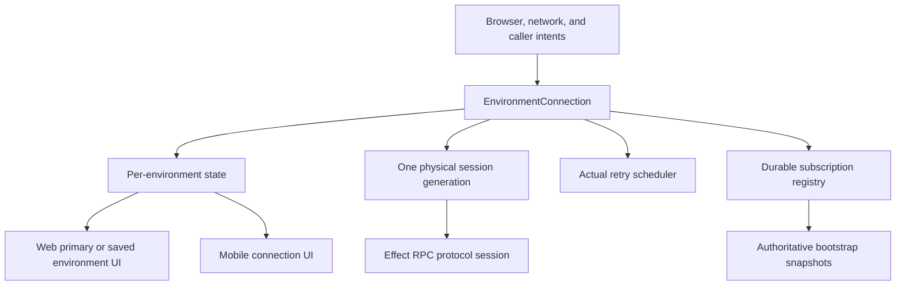

# Environment connection recovery architecture

## Status

Approved

Phase 0 was completed on 2026-07-13 by commit `65ba4f3b8`, which reverted
`5b2e494df` and discarded the uncommitted Effect request-replay experiment. The
focused transport and web recovery suite passed 39 tests after the rollback.

This spec covers Phases 1 through 5. The maintainer approved it for the Build
phase on 2026-07-13.

## Review history

A fresh `cursor/grok-4.5:fas` reviewer completed an adversarial read-only pass on
2026-07-13 and recommended **Approve after fixes**. This revision incorporates
all blocking and pre-approval findings: separate environment and subscription
readiness, remove the transport subscription retry schedule, prove server turn
continuity in Phase 1, migrate all connection-state vocabularies, delete inferred
retry deadlines, classify RPC methods, define the shared web/Electron fault
proxy, scope request tracking per environment, and name the manual evidence set.
The review's description of `WsTransport.subscribe` as a physical reconnect
owner was narrowed: its retry loop does not create sockets, but it remains an
independent stream retry scheduler and must be removed before the single-owner
invariant is true.

## Goal

Make one deep environment connection module the sole owner of connection
recovery for each environment. Prove recovery through real-runtime fault tests
that cover primary and saved environments, active chat streams, browser
lifecycle events, server restarts, and reconnect-adjacent Git workload.

The resulting behavior must keep primary and saved environment state isolated,
restore durable read subscriptions exactly once per connection generation, and
never replay mutating RPC requests without an idempotency contract.

## Source of truth

- [Architecture overview](/architecture/overview.md)
- [Remote architecture](/architecture/remote.md)
- [Provider architecture](/architecture/providers.md)
- [E2E testing foundation](/specs/2026-06-21-e2e-testing-foundation-design.md)
- `packages/client-runtime/src/environmentConnection.ts`
- `packages/client-runtime/src/environmentRuntimeState.ts`
- `packages/client-runtime/src/wsRpcClient.ts`
- `packages/client-runtime/src/wsTransport.ts`
- `packages/client-runtime/src/wsRpcProtocol.ts`
- `apps/web/src/environments/runtime/service.ts`
- `apps/web/src/rpc/wsConnectionState.ts`
- `apps/web/src/rpc/requestLatencyState.ts`
- `apps/web/src/components/WebSocketConnectionSurface.tsx`
- `apps/server/src/vcs/VcsStatusBroadcaster.ts`
- `apps/server/src/vcs/GitVcsDriverCore.ts`

The archived [provider-neutral runtime determinism plan](/specs/plans/17-provider-neutral-runtime-determinism.md)
describes an earlier transport implementation. Its claims about one explicit
client state machine, disconnected request queuing, and transport-owned push
caching do not describe the current Effect RPC transport.

## Verified current state

1. Effect RPC owns physical socket retries and heartbeat timeout handling in
   `wsRpcProtocol.ts`.
2. `WsTransport` can replace its complete Effect runtime through `reconnect()`,
   retries subscriptions independently, fences prior sessions, and retires old
   runtimes asynchronously.
3. Web focus, online, retry-deadline, and manual actions can call the primary
   connection's `reconnect()`.
4. Browser resume handling can call `reconnect()` on stale saved connections.
5. Every web `WsTransport`, including saved environments, writes into one
   `wsConnectionStatusAtom` through `webWsTransportOptions`.
6. `WebSocketConnectionCoordinator` reads that singleton state and acts on the
   primary environment, so saved-environment lifecycle events can affect primary
   state and recovery.
7. `apps/web/src/environments/runtime/service.ts` is 2,146 lines and combines
   the environment registry, endpoint/auth bootstrap, thread subscriptions,
   projections, and browser recovery.
8. Remote Git status fetches use a five-second timeout and per-repository cache,
   but have no server-wide concurrency bound.
9. Unit tests cover individual transport and UI behaviors. They do not compose
   Effect retry, session replacement, multiple environments, browser triggers,
   and active subscriptions in one real-runtime scenario.
10. Phase 0 restores the pre-`5b2e494df` baseline. A physical socket retry may
    leave an existing subscription stale until refresh. This known defect is
    accepted only while Phases 1 through 3 are being implemented.

## Constraints

- Keep WebSocket as the client-to-environment transport.
- Preserve the `ExecutionEnvironment`, `KnownEnvironment`, and
  `AccessEndpoint` model in [remote architecture](/architecture/remote.md).
- Implement shared lifecycle behavior in `packages/client-runtime`; web and
  mobile adapters may project that state into platform UI.
- Keep `packages/contracts` schema-only.
- Do not patch Effect internals to replay active RPC requests.
- Do not replay raw encoded RPC requests.
- Do not automatically retry mutating requests without an explicit operation
  ID and server-side deduplication contract.
- Preserve `e2e/tests/web/recorded.spec.ts`, browser codegen support,
  `desktop-release`, target-aware shared fixtures, isolated web infrastructure,
  and file-scoped E2E session reuse.
- Keep native-only E2E behavior behind explicit target guards.
- Keep VCS remote refresh independent from connection readiness and chat
  delivery.
- Use test-first implementation within every phase.
- Commit each phase atomically and leave the worktree clean before starting the
  next phase.

## Out of scope

- Replacing Effect RPC or the server WebSocket protocol.
- Redesigning relay, pairing, SSH, sandbox, or provider execution protocols.
- Guaranteeing exactly-once mutation semantics across network failure.
- A broad rewrite of all logic in `apps/web/src/environments/runtime/service.ts`.
  Only connection and subscription responsibilities needed by this design move.
- General Git performance work outside remote status refresh scheduling.
- New user-facing connection settings.

## Approaches considered

### A. Application-owned per-environment connection module

Deepen `EnvironmentConnection` so it owns one connection state machine, physical
session generations, actual retry scheduling, durable subscriptions, and
observable state. Configure each Effect protocol session to terminate on
physical connection loss. Browser and UI code submit idempotent connection
intents to this module.

This is the selected approach. It creates one interface and one test seam for
all recovery behavior while retaining Effect RPC serialization and request
handling.

### B. Effect-owned physical recovery with application stream restart

Retain Effect's hidden physical retry schedule and teach the application to
restart streams when Effect reports a new socket. This keeps less session code
in the application, but Effect does not expose the complete retry state required
by the UI and does not distinguish safe subscription replay from unsafe command
replay at the application domain level.

### C. Keep current owners and scope global telemetry by environment

Make the global web state environment-keyed while retaining Effect retry,
`WsTransport.reconnect()`, subscription retry loops, and coordinator watchdogs.
This fixes primary/saved state contamination but leaves concurrent recovery
authorities and timing-derived retry state in place.

## Architecture

### Deep environment connection module

`EnvironmentConnection` becomes the connection lifecycle interface consumed by
web and mobile. Its implementation absorbs physical session ownership,
connection generation, backoff, browser/network intent coalescing, durable
subscription registration, bootstrap completion, and disposal.

Its observable state is a discriminated union with these states:

- `idle`: connection has not been requested.
- `connecting`: one generation is opening, with generation and attempt identity.
- `connected`: the generation is open and the environment-level bootstrap gate
  resolved.
- `backingOff`: the next retry deadline and last failure are known.
- `failed`: configured automatic attempts are exhausted.
- `disposed`: terminal state with no active socket or retry timer.

The environment-level bootstrap gate covers shell state plus lifecycle and
configuration snapshots when that connection observes them. Per-thread detail,
terminal attachment, preview, VCS, and other optional streams have independent
per-subscription readiness. They never block the environment from becoming
`connected`.

Network availability is explicit state metadata. The UI derives `offline` from
that metadata instead of creating a second recovery state machine. This union is
the canonical connection model and replaces or maps the current
`EnvironmentConnectionState` in `environmentRuntimeState.ts`, the web
`WsConnectionStatus` phase fields, and saved-environment connection strings.
Web and mobile consume the same shared state and only project platform display
labels.

The module exposes connection intent, state observation, RPC access, durable
subscription registration, explicit manual retry, and disposal. Exact
TypeScript names are chosen during Build after a focused module-interface test.
Lifecycle methods are not exposed on the RPC client facade.



### Single recovery owner

The application-owned environment connection module is the only automatic
reconnect owner.

- A physical socket failure terminates the current Effect protocol session.
- The environment connection module transitions to `backingOff` and owns the
  next retry timer.
- A retry creates one new generation and one new Effect runtime.
- `online`, focus, visibility, pageshow, and manual Retry produce intents.
- `ensureConnected`-style intent is coalesced when the module is already
  connecting or connected.
- Manual Retry may advance a pending backoff, but still creates at most one new
  generation.
- Old-generation lifecycle events and stream values are rejected by generation
  identity.
- `WsTransport.subscribe` no longer owns a forever retry delay or starts stream
  attempts against a failed protocol session. Subscription lifetimes are bound
  to one generation; Phase 3's registry is the only restart path.
- The state exposed to the UI contains the scheduler's actual attempt count and
  retry deadline. UI code does not reconstruct retry timing. The existing
  `applyDisconnectState` deadline inference and coordinator retry watchdog are
  removed during migration.

### Environment isolation

Every connection state and request tracker is keyed by `EnvironmentId` and owned
by that environment connection.

- The connection surface observes only the primary environment.
- Saved environment cards observe their own state.
- A saved environment event cannot mutate primary state, request latency, retry
  count, toast state, or socket generation.
- `clearAllTrackedRpcRequests` is replaced by per-environment request tracking;
  one connection clears only its own pending acknowledgements.
- Browser resume may call connection intent for each environment independently.

The singleton `wsConnectionStatusAtom` and global request-clear behavior are
removed after all consumers migrate.

### RPC recovery classes

RPC work has three recovery classes:

1. **Durable read subscription**: registered declaratively and restarted once
   after a new generation opens. It must receive an authoritative snapshot
   before the connection's relevant bootstrap gate resolves.
2. **Unary request**: fails with a typed connection-loss error when its
   generation is replaced. Callers may explicitly retry reads known to be
   idempotent.
3. **Mutating request or operation stream**: never replays automatically. An
   ambiguous disconnect surfaces an error that tells the caller to reconcile
   current state before another action.

The preliminary method inventory is:

| Recovery class                       | Methods and default                                                                                                                                                                                                                                                                                     |
| ------------------------------------ | ------------------------------------------------------------------------------------------------------------------------------------------------------------------------------------------------------------------------------------------------------------------------------------------------------- |
| Durable read subscription            | `subscribeServerLifecycle`, `subscribeServerConfig`, `subscribeAuthAccess`, `subscribeShell`, `subscribeThread`, `subscribeVcsStatus`, `subscribeTerminalEvents`, `subscribeTerminalMetadata`, `subscribePreviewEvents`, and `subscribeDiscoveredLocalServers` restart from authoritative server state. |
| Unary request                        | Every unary request fails on generation loss. The ADR may opt in idempotent reads such as list/get/browse/diff/status methods only after documenting evidence and caller behavior.                                                                                                                      |
| Mutating request or operation stream | Mutation methods, `gitRunStackedAction`, `cloudInstallRelayClient`, sandbox test/login progress, `terminalAttach`, and `previewAutomationConnect` never restart automatically unless a later server contract adds an operation ID or resumable cursor.                                                  |

Phase 1 produces an exhaustive method-by-method ADR inventory. An unlisted
stream defaults to class 3, and an unlisted unary request fails without automatic
retry.

### Server turn continuity contract

A client WebSocket disconnect must not abort an accepted provider turn or its
orchestration processing. After reconnect, a new `subscribeThread` snapshot must
contain the current partial or completed turn. Phase 1 proves this behavior with
a real server integration test before Phase 2 starts. If the server aborts or
loses accepted turn state on client disconnect, Build stops and returns to Plan
to redefine AC-10 and the reconciliation UX.

### VCS remote refresh scheduler

A deep server module owns remote Git status refresh scheduling across
repositories. The initial implementation uses a server-wide concurrency limit
of two fetches, keyed cache/cooldown by Git common directory and remote, the
existing five-second command timeout, and jittered poll starts.

Local status is emitted without waiting for remote fetch completion. Remote
status is asynchronous enrichment. Recreating a WebSocket subscription retains
an existing repository poller and does not invalidate the remote refresh cache.
Failures keep cached refs, emit bounded structured diagnostics, and enter the
failure cooldown.

## Implementation phases

### Phase 1: Establish invariants and observability

1. Add an ADR that records application-owned recovery, per-environment state,
   and RPC recovery classes.
2. Add the discriminated connection state model and pure transition tests.
3. Add environment ID, connection generation, attempt, transition reason, and
   reconnect owner to structured client diagnostics.
4. Add characterization tests that fail when saved connection events affect
   primary state or more than one generation opens for concurrent intents.
5. Prove in an integration spike that a non-retrying Effect protocol session
   terminates cleanly on socket loss and can be disposed without leaving a
   physical retry active. Phase 2 is blocked until this proof passes.
6. Prove the server turn continuity contract: client disconnect does not cancel
   an accepted turn, and a later thread snapshot contains its partial or
   completed state. Phase 2 is blocked until this proof passes.
7. Prove one harness-owned WebSocket reverse proxy can route both `web-dev` and
   `desktop-dev` through an advertised proxy port to a separate real server
   upstream port. Phase 5 fault work is blocked until both targets pass.
8. Inventory every RPC method into the three recovery classes in the ADR. Treat
   unlisted streams as operation streams and never auto-retry them.
9. Define the canonical state migration from `EnvironmentConnectionState`,
   `WsConnectionStatus`, and saved-environment state to the shared union.
10. Correct the stale client transport section in provider architecture and
    link the new ADR and this spec.

### Phase 2: Install one reconnect owner

1. Deepen `EnvironmentConnection` to own one physical session generation and
   the retry scheduler.
2. Configure Effect protocol sessions without internal automatic reconnect.
3. Migrate primary, saved, web, and mobile consumers to the canonical
   per-environment observable state; remove or deprecate the prior state
   vocabularies in the same phase.
4. Replace focus, online, visibility, pageshow, timeout, and manual replacement
   calls with coalesced connection intents.
5. Make the web connection coordinator display primary state and submit manual
   intent only. Remove its inferred retry watchdog and all locally reconstructed
   retry deadlines.
6. Remove `WsTransport.subscribe`'s independent retry schedule. A stream attempt
   is generation-scoped and cannot open a socket, replace a session, or retry
   against a failed protocol.
7. Fence lifecycle events and physical sockets by environment and generation.
8. Remove the singleton connection state once all consumers use environment
   state.

### Phase 3: Separate subscription and request recovery

1. Add a declarative durable subscription registry inside the connection
   module.
2. Restart each active durable subscription exactly once after a generation
   reaches the open state.
3. Resolve the environment-level bootstrap gate from shell plus applicable
   lifecycle/config snapshots. Resolve thread, terminal, preview, VCS, and other
   retained streams through independent per-subscription readiness after their
   authoritative snapshot or first contract-defined ready event.
4. Keep old-generation events fenced after replacement.
5. Return typed connection-loss errors for unary requests and operation streams.
6. Add explicit retry only at call sites whose operations are proven idempotent.
7. Verify that active chat projection updates continue after an induced socket
   interruption without a browser refresh.

### Phase 4: Bound VCS recovery workload

1. Extract remote refresh concurrency, cache, cooldown, and jitter behind one
   scheduler interface.
2. Limit active remote fetches to two across the server.
3. Emit local status before a controlled pending remote refresh completes.
4. Preserve one ref-counted poller per repository across reconnecting
   subscribers.
5. Keep successful cache entries warm and apply failure cooldown without
   repeated stack-level warning output.
6. Add tests for concurrency, reconnect resubscription, timeout, cooldown, and
   cached-ref behavior.

### Phase 5: Real-runtime fault acceptance

1. Add a harness-owned local WebSocket reverse proxy on the client's advertised
   server port, with the real Kata server on a separately allocated upstream
   port. Both `web-dev` and `desktop-dev` route through this same proxy seam. It
   records attempts and can close, pause, reject, or restore one environment
   connection without production fault RPCs or manually opened mock replacement
   sockets.
2. Cover primary recovery while one saved environment fails repeatedly.
3. Cover an interrupted active chat response and assert completion appears
   without refresh.
4. Cover a ten-second server outage followed by restoration.
5. Cover hidden/visible, pageshow, focus, and online events during recovery.
6. Cover server restart with active shell, thread, config, terminal, and VCS
   subscriptions.
7. Cover twenty repositories with controlled failing remotes and assert the
   server-wide fetch limit.
8. Run the same user-visible recovery assertions on `web-dev` and
   `desktop-dev`, with explicit guards only for native behavior.
9. Capture Playwright snapshots for user-visible recovery and update the E2E
   catalog with acceptance-criterion coverage.
10. Run all repository and full E2E gates from a clean process state.

## Acceptance criteria

1. **AC-1, recovery decision:** An accepted ADR names the environment connection
   module as the only automatic reconnect owner, defines the three RPC recovery
   classes, and classifies every current RPC method. Unlisted streams default to
   class 3 and unlisted unary requests receive no automatic retry.
2. **AC-2, explicit state:** Connection state is a discriminated union covering
   `idle`, `connecting`, `connected`, `backingOff`, `failed`, and `disposed`;
   transition tests reject invalid transitions and stale generations. Web,
   mobile, primary, and saved-environment consumers no longer maintain a second
   connection-state vocabulary.
3. **AC-3, diagnostic identity:** Every connection transition diagnostic carries
   `environmentId`, generation, attempt, and reason. A captured recovery log can
   reconstruct one environment's complete sequence without relying on socket
   URL or message order.
4. **AC-4, single socket generation:** Under simultaneous disconnect, focus,
   online, pageshow, and manual retry triggers, an integration test observes at
   most one non-retiring `CONNECTING` or `OPEN` physical socket per environment
   and never observes two connecting sockets for that environment.
5. **AC-5, coalesced intent:** Ten concurrent connection intents for the same
   disconnected environment create one connection generation. Intents while
   connected create none.
6. **AC-6, actual retry state:** UI attempt count and retry deadline equal values
   emitted by the connection scheduler. No web timer or disconnect reducer
   computes a replacement retry deadline or replaces a session because a
   deadline appears stalled.
7. **AC-7, environment isolation:** A saved environment can exhaust retries while
   the primary connection remains `connected`; primary retry count, per-environment
   latency tracker, toast state, and generation remain unchanged. Clearing the
   saved connection's tracked requests does not clear the primary tracker.
8. **AC-8, browser lifecycle safety:** Focus, visibility, pageshow, and online
   events do not replace a healthy or currently connecting generation. An
   offline connection resumes through one coalesced intent when network state
   returns.
9. **AC-9, durable subscription recovery:** Each retained durable subscription
   restarts exactly once on a new generation, resolves its own readiness after
   an authoritative snapshot or contract-defined ready event, and ignores values
   emitted by prior generations. Optional thread and terminal subscriptions do
   not block the environment-level `connected` state.
10. **AC-10, live chat recovery:** A Phase 1 real-server integration test first
    proves that client disconnect does not abort an accepted turn and that a
    later thread snapshot contains its partial or completed state. With a
    deterministic real server fixture producing a multi-event response, an
    induced WebSocket loss then recovers and renders the completed assistant
    response without page refresh on both `web-dev` and `desktop-dev`.
    Maintainer-local UAT repeats the interruption with one configured real
    provider on each client and captures evidence.
11. **AC-11, request safety:** A transport test proves an unacknowledged mutating
    RPC request is never automatically resent. The caller receives a typed
    connection-loss result and must reconcile before another action.
12. **AC-12, explicit unary retry:** Any automatic unary retry added by the Build
    is listed in the ADR with evidence that the operation is idempotent. All
    unlisted unary requests fail on generation loss.
13. **AC-13, bounded Git fetches:** With twenty repositories requesting remote
    status concurrently, instrumentation and tests observe no more than two
    active `git fetch` operations.
14. **AC-14, local-first VCS status:** A controlled test holds remote refresh
    pending and still receives local status. Releasing remote refresh emits the
    remote update separately.
15. **AC-15, poller retention:** Disconnecting and reconnecting subscribers for
    one repository retains one remote poller and one cache identity; repeated
    failing refreshes obey the configured failure cooldown.
16. **AC-16, real-runtime fault suite:** A harness-owned reverse proxy routes both
    `web-dev` and `desktop-dev` to a separate real server port. Automated fault
    tests use it to cover saved-environment failure, ten-second server outage,
    server restart, browser lifecycle events, active chat, and VCS load without
    production fault hooks or manually opened mock replacement sockets.
17. **AC-17, user-visible evidence:** Manual Playwright validation captures these
    named artifacts for both web and Electron: `reconnecting`,
    `recovered-completed-chat`, and `saved-failed-primary-connected`. Each
    artifact includes the visible app state and its corresponding connection
    transition log.
18. **AC-18, cross-platform E2E:** New tests use target-aware shared fixtures on
    `web-dev` and `desktop-dev`; browser-only recording tests, codegen support,
    and `desktop-release` remain present and discoverable.
19. **AC-19, repository gates:** `vp check`, `vp run typecheck`, `vp run test`,
    and `vp run release:smoke` pass. `vp run lint:mobile` also passes if mobile
    code changes.
20. **AC-20, complete E2E gates:** Fresh `vp run e2e:web` and
    `vp run e2e:desktop` runs pass in full after `vp run e2e:clean`. A focused
    subset is insufficient for completion.
21. **AC-21, documentation:** Architecture notes describe the implemented
    connection owner, per-environment state, RPC recovery classes, and VCS
    scheduler. The specs roadmap and E2E catalog link the evidence.

## Verification strategy

### Unit and state-model tests

- Pure transition tests for every connection state and stale generation.
- Intent coalescing and retry deadline tests with a deterministic clock.
- Subscription registry tests for one restart, snapshot gating, cancellation,
  and stale event fencing.
- Request classification tests proving mutation non-replay.
- VCS scheduler tests with a controlled deferred fetch and concurrency counter.

### Integration tests

- Real Effect RPC client and local WebSocket server.
- Physical disconnect without Effect-owned retry.
- Server turn continuity across client disconnect and thread-snapshot recovery.
- Environment connection recreation and disposal with socket-attempt counting.
- Multiple environment connections sharing one browser process while retaining
  isolated state.
- Shared reverse-proxy routing for `web-dev` and `desktop-dev`.
- Real `VcsStatusBroadcaster` with controlled Git workflow adapters.

### E2E and manual acceptance

Add a `@connection` feature tag and compose tests from `e2e/src/harness/` and
`e2e/src/flows/`. Run focused development checks with:

```bash
vp run e2e --project web-dev --grep @connection
vp run e2e --project desktop-dev --grep @connection
```

Before signoff:

```bash
vp run e2e:clean
vp check
vp run typecheck
vp run test
vp run release:smoke
vp run e2e:web
vp run e2e:desktop
```

Manual validation must use the running web and Electron applications, walk each
user-visible criterion, and capture snapshots. E2E artifact diagnostics must
retain client connection transitions, server WebSocket logs, and VCS scheduler
counters on failure.

## Sequencing and commit gates

1. Phase 1 may change types, diagnostics, tests, ADRs, and architecture docs. It
   does not change production reconnect ownership except for the Effect
   non-retry feasibility spike under test.
2. Phase 2 starts only after the Effect non-retry, server turn continuity, and
   shared web/Electron fault-proxy integration proofs pass.
3. Phase 3 starts only after primary and saved connection isolation passes in
   integration tests.
4. Phase 4 can proceed in parallel with Phase 3 only in an isolated worktree and
   with one final integrator; its verification remains independent of transport
   causality claims.
5. Phase 5 starts after Phases 2 through 4 pass focused tests and repository
   typecheck.
6. Each phase receives one or more atomic Conventional Commits and ends with a
   clean worktree.
7. A failed acceptance criterion blocks phase completion. Any deferred work must
   be filed immediately through `.github/ISSUE_TEMPLATE/deferred_work.yml` and
   linked from the spec and deferred-work registry.

## Risks and mitigations

- **Effect session termination behavior:** Phase 1 blocks implementation until a
  real integration spike proves a session can terminate and dispose cleanly
  without hidden retry.
- **Server turn continuity:** Phase 1 blocks implementation until a real server
  proves an accepted turn survives client disconnect and is recoverable through
  a later thread snapshot.
- **Fault-proxy routing:** Phase 1 blocks Phase 5 harness work until the same
  harness-owned proxy seam can route both web and Electron to separate real
  server ports.
- **Large call-site migration:** Preserve the RPC method facade while removing
  lifecycle methods from consumer reach. Migrate connection ownership before
  moving unrelated environment service logic.
- **Duplicate operations after ambiguous disconnect:** No encoded request replay;
  mutations fail with an explicit reconciliation requirement.
- **Subscription snapshot gaps:** A new generation reports environment
  bootstrap from shell plus applicable lifecycle/config snapshots. Optional
  subscriptions expose separate readiness and do not hold the environment in a
  reconnecting state.
- **Browser timer throttling:** Retry deadlines belong to the connection module;
  resume events submit intent and never infer socket health from elapsed browser
  time alone.
- **E2E flakiness:** Faults are harness-controlled and asserted through semantic
  state and attempt counters rather than sleeps. The ten-second outage is an
  explicit scenario, not an arbitrary readiness delay.
- **VCS workload causality:** VCS scheduling is verified as an independent
  reliability property. The Build must not claim it caused or fixed WebSocket
  closure without measured evidence.

## Suggested file map

Likely new or deepened modules:

- `packages/client-runtime/src/environmentConnection.ts`
- `packages/client-runtime/src/environmentConnectionState.ts`
- `apps/server/src/vcs/RemoteStatusRefreshScheduler.ts`
- `e2e/src/harness/wsFaultAdapter.ts`
- `e2e/src/flows/connectionRecovery.ts`
- `e2e/tests/connection/recovery.spec.ts`

Likely migrations or removals:

- `packages/client-runtime/src/wsTransport.ts`
- `packages/client-runtime/src/wsRpcProtocol.ts`
- `apps/web/src/environments/runtime/service.ts`
- `apps/web/src/rpc/wsConnectionState.ts`
- `apps/web/src/rpc/wsTransport.ts`
- `apps/web/src/components/WebSocketConnectionSurface.tsx`
- `apps/server/src/vcs/VcsStatusBroadcaster.ts`
- `apps/server/src/vcs/GitVcsDriverCore.ts`

The Build may adjust file names after applying the deletion test. It must retain
one deep environment connection module and one deep remote refresh scheduler,
not replace them with several shallow forwarding modules.

## Build handoff

Build begins only after this spec is Approved.

Start with Phase 1 and write failing invariant tests before production changes.
The blocking proofs are non-retrying Effect session termination, server turn
continuity across client disconnect, and one shared web/Electron fault-proxy
route. If any proof fails, stop with the observed behavior and return to Plan;
do not add another reconnect owner, patch Effect request replay, or defer the
failed proof to Phase 5.

The Build completion report must map every acceptance criterion to a test,
command, snapshot, or explicit Blocked result. Verification cannot call the
work complete until both full E2E projects pass from a clean process state.
