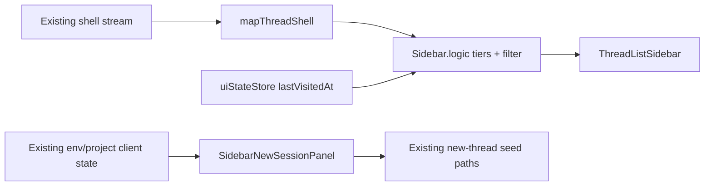

# Sidebar v2: attention tiers + project picker

## Status

**Implemented** (2026-07-15). Phases A–D landed on `sidebar-redesign`:
attention tiers + project picker + accordion new-session on existing APIs,
pixel-contract CSS from `c-attention-session.html`. Verify (AC 11 visual
sign-off + `@sidebar` E2E headed) still required before merge.

## Goal

Replace the current project-grouped thread sidebar in `apps/web` with:

1. **Attention tiers** — threads sorted into Waiting / Working / Blocked /
   Idle (Idle collapsed by default until clicked).
2. **Project picker filter** — optional scope by logical project/repo; no
   filter chips under the picker.
3. **Accordion new session** — global `+` opens a project accordion; click a
   connected environment to start via **existing** new-thread /
   environment-selection APIs (no new env contracts).
4. **Meta row** — project chip · branch · model (when available) · time ·
   existing remote/env badge.

Also: surface Failed sessions (`session.lastError`); remove per-project
"show more" so actionable work cannot hide behind collapse.

Visual source of truth: the interactive frontend prototype
[`c-attention-session.html`](../comps/sidebar-v2-prototypes/c-attention-session.html)
— implement that look exactly; it defines the new sidebar design language.

## Hard scope boundary (non-negotiable)

This ship is a **sidebar presentation + chrome** change on web/desktop.

**In scope:** `apps/web` sidebar UI and pure helpers (`Sidebar.tsx`,
`Sidebar.logic.ts`, thin extracted list/card components, related Vitest
browser + `@sidebar` E2E). Wire new-session UI to existing
`resolveSidebarNewThreadSeedContext` / project / environment selection
paths already used today.

**Out of scope (do not touch):**

- Kata environments / sandbox / deploy services, drivers, Settings
  environments UI, relay linking, or BYOC contracts.
- New multi-env data model or environment create/connect/auth flows.
- Broad `packages/contracts` redesign. Optional **additive** shell fields
  only if an acceptance criterion is blocked without them (see
  [Optional shell enrichments](#optional-shell-enrichments)); default is
  **no server work**.

If Build discovers a need that would change environments behavior, **stop
and amend this spec** — do not expand the PR.

## Normative frontend prototype (pixel contract)

**`c-attention-session.html` is not a mood board.** It is the shipped visual
and interaction contract for the sidebar. Build must match it **exactly**
(tokens, density, typography, tier chrome, picker, accordion new-session,
row anatomy), with only minor polish allowed (a11y focus rings, motion
timing, edge-case empty states).

**What NOT to do (failed-attempt lesson):** treat the prototype as a general
reference and “adapt it” into the current app design language. The prototype
**is** the new sidebar design language. Do not restyle cards, rails, chips,
or chrome to match pre-v2 Sidebar patterns, Tailwind defaults elsewhere in
the app, or older Figma comps.

Working prototype (normative):

- [`docs/comps/sidebar-v2-prototypes/c-attention-session.html`](../comps/sidebar-v2-prototypes/c-attention-session.html)
- Serve: `docs/comps/sidebar-v2-prototypes/serve.sh` →
  `http://127.0.0.1:8765/c-attention-session.html`
- Captures that define look: `shot-accordion-fixed.png`,
  `shot-c-multi-env.png`, `shot-variant-c.png` in the same folder.

Port CSS variables and structure from the prototype into the web sidebar
(shared tokens / scoped stylesheet), rather than inventing a parallel look.

Archive only (non-normative):

- [`docs/comps/sidebar-v2-prototypes/project-identity.html`](../comps/sidebar-v2-prototypes/project-identity.html)
  (A / B / 0 / first C)
- Earlier exploration (history): <https://hsyscdqldmk5.postplan.dev/>,
  [`docs/comps/SCR-20260714-ivzt-2.png`](../comps/SCR-20260714-ivzt-2.png)

## Verified current state

- `apps/web/src/components/Sidebar.tsx` renders a project-grouped tree.
  `getVisibleThreadsForProject` in `Sidebar.logic.ts` implements
  `previewLimit` + "show more" per project.
- `SidebarThreadSummary` is populated from `OrchestrationThreadShell`
  (`packages/contracts/src/orchestration.ts`, projected in
  `ProjectionSnapshotQuery.ts`). It already carries: `session` (incl.
  `lastError`, `status`), `latestTurn`, `branch`, `worktreePath`,
  `latestUserMessageAt`, `hasPendingApprovals`, `hasPendingUserInput`,
  `hasActionableProposedPlan`, `interactionMode`, and environment /
  remote-related fields used by today's cloud badge.
- `modelSelection` exists on the shell but is dropped by `mapThreadShell`
  today — optional enrichment only.
- Unread / unseen completion: `threadLastVisitedAtById` +
  `hasUnseenCompletion`.
- `resolveThreadStatusPill` has no Failed state today.
- Live activities and per-turn diff stats exist on full threads, not
  necessarily on the shell — optional enrichment only; Build may use
  coarser status verbs without them.
- Sidebar chrome on group headers today: per-project new-thread
  (`data-testid="new-thread-button"`), `ProjectSortMenu`, add-project
  (`data-testid="sidebar-add-project-trigger"`).
- No existing E2E targets the sidebar; Vitest browser fixtures exist.

## Constraints

- Web + desktop only (`apps/web`); mobile untouched.
- Replace-outright layout: remove project group headers and "show more".
  No layout toggle.
- Keep `sidebarThreadSortOrder` for Idle / within-tier ordering where
  applicable. Retire grouped-only Settings UI (`sidebarThreadPreviewCount`
  panel, `ProjectSortMenu`, dnd-kit project reorder in sidebar). Keep
  schema fields for backward decode. Keep `sidebarProjectGroupingMode` /
  `logicalProject.ts` for chips + picker.
- Preserve: selection, multi-select, context menus, keyboard traversal,
  archive, search/⌘K, prewarming, and **existing** remote-environment
  affordances (display only; do not reimplement env lifecycle).
- Performance: respect `sidebarThreadSummariesEqual`; local 1s ticker for
  elapsed timers (no store writes per tick).
- Atomic PRs: each phase leaves `vp check` and `vp run typecheck` green;
  run environments-related smoke / existing suites as regression gate
  before merge (do not "fix" environments inside this work).

## Out of scope

- Inline Approve / Review on Waiting cards (safety unresolved).
- Message-snippet Inbox treatment; Ops Grid.
- Mobile sidebar.
- Server-side PR state in the shell stream.
- Archive affordance redesign.
- Environments / sandbox / deploy architecture (see hard boundary).

## Design

### List structure — attention tiers

One scrollable list, **four tiers**, no project group headers. Tiers are
state-driven; empty tiers are omitted.

| Tier        | Predicate (observable)                                                                                                                                       | Density                                                   |
| ----------- | ------------------------------------------------------------------------------------------------------------------------------------------------------------ | --------------------------------------------------------- |
| **Waiting** | User bottleneck: pending approval, pending input, or actionable proposed plan                                                                                | Rich card; wait label; optional inline _actions deferred_ |
| **Working** | Running / connecting session                                                                                                                                 | Rich card; status verb + elapsed timer                    |
| **Blocked** | Failed / error session (`lastError` + no higher-priority state)                                                                                              | Rich card until visited; then slim with red dot           |
| **Idle**    | Settled / done (incl. done-unseen may start rich then collapse, or sit under Idle as expanded-on-click — Build matches prototype: Idle collapsed by default) | Slim row; click expands detail in-place                   |

Within Waiting: sort by wait duration longest-first when a wait timestamp
is available; otherwise stable by existing sort order.

**No "show more".** Scroll (virtualize only if 200+ threads jank).

### Project picker filter

Below search / beside chrome: dropdown "All projects" | logical projects.
Filtering scopes the tier list to that project's threads. When scoped,
show a quiet hint if Waiting items exist in other projects ("N waiting in
other projects · switch to All"). No chip row under the picker.

### Meta row

Rich cards: project chip · branch (worktree-aware) · model when present ·
time / waiting label · **existing** env/remote badge (Local implied by
absence, or reuse today's cloud badge — do not invent new env types in
contracts).

### New session accordion

Global `+` (`data-testid="new-thread-button"`) opens an inline panel:

- List logical projects as accordion rows.
- Single-env project: tap row (or Start) → create via existing seed path.
- Multi-env project: expand → list **already connected** environments from
  existing client state → tap env starts session (no confirm step).
- "+ New project" / footer add-project (`sidebar-add-project-trigger`)
  stays; opens existing add-project flow (do not reimplement Settings
  environments).
- Context menu: "New thread in this project" / "New in this env" when an
  env is known on the row — immediate start, no sheet.

Must not introduce new environment provisioning APIs.

### Status model

Extend pills with Failed. Priority: Pending Approval > Awaiting Input >
Working/Connecting > Plan Ready > Failed > Completed-unseen > none.
Map pills into tiers: approval/input/plan → Waiting; working/connecting →
Working; failed → Blocked; else → Idle.

### Wait time

Prefer real wait timestamps when already available (e.g. pending approval
`created_at`). If pending-input lacks a timestamp, **approved fallback**:
anchor on `latestTurn.completedAt` (tooltip notes approximation). Do **not**
block the UI ship on a projection migration.

### Optional shell enrichments

Only if AC cannot be met with current summaries:

- Surface `modelSelection` into `SidebarThreadSummary`.
- Optional `latestActivity` / `latestTurnDiffStats` / `blockedSince` as
  optional schema fields + projection — separate, additive PR after UI
  is green, never bundled with environments changes.

Default Build path: **UI first with existing fields**.

### Component architecture

Replace grouped rendering inside existing sidebar chrome:

- `ThreadListSidebar` — tiers, filter, scroll/virtualization, prewarm.
- `ThreadCardRich` / `ThreadRowSlim` (Idle expand).
- `SidebarProjectPicker` — filter only.
- `SidebarNewSessionPanel` — accordion; calls existing create/seed helpers.
- `Sidebar.logic.ts`: `resolveThreadTier`, density helpers, Failed pill,
  wait duration (pure + unit tests).
- Shared 1s ticker hook for elapsed text.

Dead code removal (final phase): group headers, show-more,
`getVisibleThreadsForProject`, sidebar-only dnd-kit / ProjectSortMenu.

### Data flow

## Implementation phases (atomic)

Each phase is separately committable; environments suites must stay green.

**Phase A — Logic + fixtures (no UI swap).** Tier/density/Failed helpers +
unit tests. Criteria: 2–5 (logic).

**Phase B — Flat list UI + picker.** Replace grouped tree with tiers +
project filter; relocate chrome; preserve selection/menus/keyboard.
Vitest browser state matrix. Criteria: 1–8, 10 (partial).

**Phase C — New-session accordion.** Wire `+` panel to existing APIs;
update `ChatView.browser.tsx` locators. Criteria: 9.

**Phase D — Cleanup + `@sidebar` E2E.** Delete dead grouped code; add
`@sidebar` smoke (flat list, no show-more, filter, new-thread, scroll).
Regression: existing environments-related tests untouched and green.
Criteria: 7, 9, 10.

Optional later (separate PR, only if needed): shell enrichments.

## Acceptance criteria

1. Sidebar shows one flat list with **no** project group headers; project
   identity is a chip / picker scope. E2E: ≥2 projects, no group headers.
2. Waiting tier lists approval / input / plan-ready threads above others
   when present; shows a wait label when a timestamp or fallback is
   available. Vitest browser fixtures.
3. Working tier shows rich cards with status verb and an elapsed timer
   updating ≥ every 5s without reload (anchor `latestTurn.startedAt` when
   present). E2E during a deterministic agent turn and/or browser fixture.
4. Idle threads default to slim rows; click expands in-place; no
   show-more. Vitest browser.
5. Failed sessions show Blocked treatment (red + error text); after visit,
   slim red dot. Vitest browser.
6. Project picker scopes the list; "All projects" restores full list;
   scoped Waiting hint when others wait. Vitest browser.
7. Every non-archived thread reachable by scrolling (30+ threads via API).
   E2E.
8. Rich meta row shows project chip · branch · time; remote threads keep
   today's cloud/env badge behavior. Vitest browser with remote fixture.
9. Selection, multi-select, context menus, keyboard traversal, search/⌘K,
   add-project, and new-thread (global `+` accordion + seeded context)
   work without changing environments lifecycle. Updated browser suites +
   E2E new-thread; **environments E2E / smoke remain green**.
10. `vp check`, `vp run typecheck`, and `vp run test` pass;
    `vp run e2e --project desktop-dev --grep @sidebar` after tag add.
11. **Visual match to C.** Side-by-side with
    `c-attention-session.html` (same viewport width), the implemented
    sidebar matches the prototype’s design language: dark panel tokens,
    tier headers, rich/slim row structure, picker, and new-session
    accordion. Maintainer sign-off against prototype screenshots; no
    “adapted to old Sidebar” restyle. Verified by manual
    `playwright-cli` / screenshot comparison in Verify.

## Risks and mitigations

- **Prior failed attempt.** Environments broke when sidebar work sprawled,
  and the UI drifted from design comps. Mitigate with hard boundary above,
  Phase A→D atomic commits, environments regression gate before merge, and
  the **pixel contract**: implement from `c-attention-session.html`, do not
  reinterpret into the old app chrome.
- **Density / tier jumps.** Short height animation; keep Idle collapsed.
- **Accordion over-fetch.** Only read existing connected env lists; never
  invent provisioning in the sidebar PR.
- **Insufficient shell fields.** Ship coarser copy first; optional
  enrichment PR later.
- **Browser tests hardcode group headers.** Update in Phase B/C, do not
  delete coverage.
- **E2E cannot force every state.** Fixtures for Waiting/Blocked; E2E for
  deterministic flows.

## Explicitly deferred work

File via deferred-work template when Build starts if not already filed:

- Inline Approve / Review on Waiting cards.
- Mobile adoption.
- Message-snippet density mode.
- Server-side PR in shell stream.
- Projection enrichments (`latestActivity`, `blockedSince`, etc.) if
  deferred after UI ship.

## Build handoff

- Scope: Phases A–D; web + desktop; frontend-only; replace-outright.
- Non-goals: hard boundary + out-of-scope lists.
- Verification: criteria 1–11; `kata-code-e2e-testing` for `@sidebar`;
  environments suites as regression, not rewrite targets.
- **Normative UI / new design language:**
  `c-attention-session.html` (exact match; not adapted to old Sidebar).
- Stop condition: any change that would edit sandbox/env services or
  BYOC contracts → halt and re-spec. Visual drift from C → halt and fix
  before merge.
