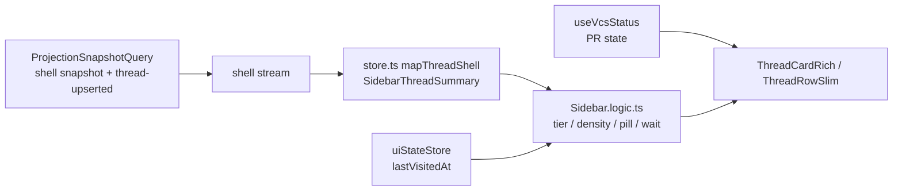

# Sidebar v2: recency-first hybrid thread list

## Status

Draft

## Goal

Replace the current project-grouped thread sidebar in `apps/web` with a single
recency-first thread list that combines three concepts from the Sidebar v2
exploration:

1. **Adaptive density** (concept 4): live and blocked threads render as rich
   cards; settled threads collapse to slim one-line rows.
2. **Needs-you pinning** (concept 3): threads blocked on the user are pinned
   above the recency list, sorted by how long they have been waiting.
3. **Meta row** (concept 1): rich cards carry a project chip, branch, model,
   and time so project identity survives the removal of group headers.

The new sidebar also fixes two gaps in the current implementation: failed
sessions (`session.lastError`) are invisible today, and active work can be
hidden behind the per-project "show more" collapse.

## Reference mocks

- Normative visual reference (committed): [`docs/comps/SCR-20260714-ivzt-2.png`](../comps/SCR-20260714-ivzt-2.png)
  — full-page capture of the concept exploration.
- Interactive concept demo (supplementary, may rot):
  <https://hsyscdqldmk5.postplan.dev/>.

The exploration's "hybrid" note is the shipped scope: concept 4's adaptive
density + concept 3's needs-you pinning + concept 1's meta row.

## Verified current state

- `apps/web/src/components/Sidebar.tsx` (3,514 lines) renders a
  project-grouped tree. `getVisibleThreadsForProject` in `Sidebar.logic.ts`
  implements a `previewLimit` + "show more" collapse per project.
- `SidebarThreadSummary` (`apps/web/src/types.ts`) is populated from the
  server's `OrchestrationThreadShell` stream (`packages/contracts/src/orchestration.ts`,
  projected in `apps/server/src/orchestration/Layers/ProjectionSnapshotQuery.ts`).
  It already carries: `session` (including `lastError` and `status`),
  `latestTurn` (`requestedAt`/`startedAt`/`completedAt`), `branch`,
  `worktreePath`, `latestUserMessageAt`, `hasPendingApprovals`,
  `hasPendingUserInput`, `hasActionableProposedPlan`, `interactionMode`.
- `OrchestrationThreadShell` carries `modelSelection`, but the web
  `SidebarThreadSummary` drops it (`mapThreadShell` in `apps/web/src/store.ts`).
- Unread state is client-side: `threadLastVisitedAtById` in
  `apps/web/src/uiStateStore.ts`; `hasUnseenCompletion` in `Sidebar.logic.ts`.
- `resolveThreadStatusPill` (`Sidebar.logic.ts`) implements the status
  priority: Pending Approval > Awaiting Input > Working/Connecting > Plan
  Ready > Completed-unseen. It has no Failed state.
- Live activities (`OrchestrationThreadActivity`) and per-turn diff stats
  (`OrchestrationCheckpointSummary.files` with `additions`/`deletions`) exist
  only on the full `OrchestrationThread`, not on the shell used by the
  sidebar.
- PR state comes from client-side `useVcsStatus` polling
  (`ThreadStatusIndicators.tsx`), keyed by thread branch and cwd.
- Sidebar settings in `packages/contracts/src/settings.ts`:
  `sidebarThreadSortOrder` (`updated_at` | `created_at`),
  `sidebarProjectSortOrder` (incl. `manual` with dnd-kit reordering in
  `Sidebar.tsx`), `sidebarThreadPreviewCount` (feeds only the "show more"
  collapse; has Settings-panel UI), and `sidebarProjectGroupingMode` (logical
  project grouping via `logicalProject.ts`, also used outside the sidebar).
- Sidebar chrome hosted on group headers today: per-project new-thread button
  (`data-testid="new-thread-button"`, also hardcoded in
  `ChatView.browser.tsx` tests), `ProjectSortMenu`, and the add-project
  trigger (`data-testid="sidebar-add-project-trigger"`).
- Pending-state provenance on the server: `projection_pending_approvals` rows
  carry `created_at`; pending user input is only a derived count
  (`pending_user_input_count`, computed in `ProjectionPipeline.ts`) with no
  stored timestamp for the oldest pending request.
- E2E harness (`e2e/`) has no thread-state fixture system; agent tests drive
  real providers. No existing E2E test targets the sidebar. Web component
  tests with fixture stores exist as Vitest browser tests
  (`*.browser.tsx`).
- Sidebar rows are prewarmed into the thread-detail cache
  (`SIDEBAR_THREAD_PREWARM_LIMIT = 10`, `getSidebarThreadIdsToPrewarm`).

## Constraints

- Web + desktop only. `apps/web` renders in both; mobile (`apps/mobile`) is
  untouched.
- Replace outright: the project-grouped layout, project group headers, and the
  per-project "show more" collapse are removed, along with their supporting
  logic once nothing references it. No layout setting toggle.
- The existing `sidebarThreadSortOrder` setting keeps working and drives the
  recency zone sort. Grouped-sidebar-only settings are retired: remove the
  `sidebarThreadPreviewCount` Settings-panel UI and the `ProjectSortMenu`;
  keep the schema fields (backward decode) but stop reading them in the
  sidebar. Manual project reordering and the dnd-kit apparatus in
  `Sidebar.tsx` are removed with the headers. `sidebarProjectGroupingMode`
  and `logicalProject.ts` stay: logical projects still label the project
  chip and back the new-thread project picker.
- Keep `packages/contracts` schema-only. Shell schema additions must be
  backward-decodable (optional or defaulted fields) so older clients and
  stored snapshots do not fail decoding.
- Preserve existing sidebar behaviors: thread selection and multi-select,
  context menus, keyboard traversal (`resolveAdjacentThreadId`), new-thread
  flows (`resolveSidebarNewThreadSeedContext`), project creation, archive,
  search/⌘K, thread prewarming, and remote-environment affordances.
- Performance first: the sidebar re-renders on every shell-stream event. New
  fields must flow through the existing equality gates
  (`sidebarThreadSummariesEqual` in `apps/web/src/store.ts`) so unchanged rows
  do not re-render. Live elapsed timers must tick locally (one shared
  interval), not via store updates.

## Out of scope

- Inline Approve / Review actions in the sidebar (concept 3's inline
  approvals). The demo flags this as an unresolved safety question; defer.
- Message snippets as context lines (concept 2) and the Ops Grid treatment
  (concept 5).
- Mobile sidebar changes.
- Server-side PR state in the shell stream (stays client-polled).
- Archive affordance redesign (current context-menu archive stays as is).

## Design

### List structure

One scrollable list, two zones, no project group headers:

**Needs-you zone (pinned).** Threads where the user is the bottleneck:
`hasPendingApprovals`, `hasPendingUserInput`, or plan-ready (same predicate as
today's Plan Ready pill). Sorted by wait duration, longest first. Wait
duration is measured from the timestamp of the blocking event (see "Wait time"
below). Rows here always render as rich cards and show `waiting Xm` in place
of relative message age. The zone has a slim `NEEDS YOU · n` header and is
omitted entirely when empty.

**Recency zone.** All other non-archived threads in one flat list sorted by
the existing `sidebarThreadSortOrder`. Row density adapts to state:

- **Rich card** for Working, Connecting, Failed, and Done-unseen threads:
  - Line 1: title.
  - Line 2: status verb + context. Working: latest activity summary + live
    elapsed timer (`Working — Write sidebar.tsx · 14m 22s`). Failed: first
    line of `session.lastError`, red treatment. Done-unseen: diff stats
    (`+214 −38 · 12 files`) when available.
  - Line 3 (meta row): project chip · branch (worktree-aware) · model ·
    relative time · cloud badge for remote-environment threads.
- **Slim row** for settled threads: title · status dot · compact trailing
  meta (diff stats or PR chip when available · relative time). One line,
  comparable height to today's rows.

Done-unseen cards revert to slim rows once visited (`lastVisitedAt` advances
past `latestTurn.completedAt`), reusing `hasUnseenCompletion`.

**No "show more".** Every non-archived thread is reachable by scrolling.
Virtualize the list if profiling during Build shows jank with large thread
counts (200+); otherwise plain overflow scroll is acceptable.

### Sidebar chrome in the flat layout

Group headers currently host three affordances; each gets a new home:

- **New thread.** One global `+` button in the sidebar header (keeps
  `data-testid="new-thread-button"`). It seeds from the active thread's
  project via `resolveSidebarNewThreadSeedContext`; when no thread is active
  it opens a project picker listing logical projects. Thread-row context
  menus gain "New thread in this project" for explicit targeting.
  `ChatView.browser.tsx` tests that reach the button through the project
  header structure are updated to the new location.
- **Add project.** Moves to the sidebar footer (keeps
  `data-testid="sidebar-add-project-trigger"`). Project management
  (rename, remove) stays reachable via a projects section in Settings or the
  new-thread project picker's context menu; exact placement is a Build-time
  call, but the affordance must exist (criterion 9).
- **Project sort menu.** Removed with grouping; no replacement.

### Status model

Extend the existing `ThreadStatusPill` vocabulary with `Failed`: a session
whose `status` is `"error"` or `"closed"` with a non-empty `lastError`, and no
higher-priority state. Priority order becomes: Pending Approval > Awaiting
Input > Working/Connecting > Plan Ready > Failed > Completed-unseen > none.
Exact predicate is settled in Build against `session-logic.ts`; the observable
requirement is acceptance criterion 5.

**Failed lifetime.** Failed follows the same seen/unseen rule as Done:
Failed-unseen renders as a rich card (red treatment + error text); once
visited (`lastVisitedAt` advances past the error time) it collapses to a slim
row with a red dot. A newer turn starting on the thread clears the Failed
treatment regardless of visit state. Build must verify whether
`session.lastError` is cleared on a successful subsequent turn and gate the
predicate on turn recency if it is not.

**Slim-row dot.** Slim rows show a trailing dot only when it encodes
something: red for failed-seen. Otherwise no dot; diff stats, PR chip, and
relative time are the only trailing meta.

### Wait time

Blocked threads show how long the user has been the bottleneck, as
`waiting Xm` (minutes under an hour, then `waiting 3h`, `waiting 2d`):

- Pending approval: elapsed since the oldest `projection_pending_approvals`
  row's `created_at` (already stored).
- Pending input: pending user input is currently a derived count in
  `ProjectionPipeline.ts` with no stored timestamp. Phase 1 adds an
  oldest-pending-input timestamp to the shell summary projection
  (`ProjectionPipeline` change + schema migration alongside
  `023_ProjectionThreadShellSummary`). If that projection proves
  disproportionate during Build, the approved fallback is anchoring on
  `latestTurn.completedAt` with the approximation noted in the row tooltip.
- Plan ready: elapsed since `latestTurn.completedAt`.

Both feed one shell field, `blockedSince: IsoDateTime | null`. Needs-you
threads with null `blockedSince` sort after those with timestamps.

### Contract and server changes

Extend `OrchestrationThreadShell` (and mirror into web `SidebarThreadSummary`
via `mapThreadShell`):

- `latestActivity: { tone, summary, createdAt } | null` — most recent
  activity for the latest turn; powers the rich-card "what is it doing" line.
- `latestTurnDiffStats: { additions, deletions, fileCount } | null` —
  aggregated from the latest checkpoint's files.
- `blockedSince: IsoDateTime | null` — oldest pending approval/input
  timestamp; null when not blocked.
- Surface the existing `modelSelection` field into `SidebarThreadSummary`.

All three new fields are optional/defaulted in the schema. Server-side work
spans `ProjectionSnapshotQuery.ts` (shell snapshot, archived shell snapshot
where applicable, and the `thread-upserted` event path), the
`ProjectionPipeline.ts` pending-input timestamp derivation, and one schema
migration for the projected column. Update `sidebarThreadSummariesEqual` and
the relay/server tests that construct shell fixtures.

Streaming churn: activity summaries update at most per activity event (not
per token). If Build finds activity events too chatty, debounce upserts of
`latestActivity` server-side; the acceptance bar is criterion 3, not update
frequency.

### Component architecture

New component tree replacing the grouped rendering inside the existing
sidebar chrome (search, new-thread button, footer, context-menu plumbing stay):

- `ThreadListSidebar` — zones, sorting, virtualization decision, prewarm
  wiring (`getSidebarThreadIdsToPrewarm` now takes the flat visible list).
- `ThreadCardRich` — three-line card (needs-you + active/failed/done-unseen).
- `ThreadRowSlim` — one-line settled row.
- `Sidebar.logic.ts` additions (pure, unit-tested): `resolveThreadTier`
  (needs-you vs recency), `resolveThreadRowDensity` (rich vs slim),
  `resolveWaitDuration`, `Failed` pill support in `resolveThreadStatusPill`.
- One shared 1s ticker hook for elapsed timers so N cards do not create N
  intervals; timer text renders locally without store writes. Timers anchor
  on `latestTurn.startedAt`.

Dead code removal: project group headers, expand/collapse state,
`getVisibleThreadsForProject`, `sortProjectsForSidebar`,
`resolveProjectStatusIndicator`, and `sidebarProjectGrouping.ts` usages that
serve only the grouped sidebar. Remove in the final phase once nothing
references them. `Sidebar.tsx` should shrink substantially; splitting
retained chrome into focused modules is in scope where it falls out
naturally, broader refactors are not.

Row height changes animate (150–200ms height transition) so density flips do
not feel jumpy; exact treatment is a Build-time call, and the demo flags this
as the main risk of concept 4.

### Data flow

## Implementation phases

Each phase leaves `vp check` and `vp run typecheck` green and is separately
committable.

**Phase 1 — Contracts + projection.** Add `latestActivity`,
`latestTurnDiffStats`, `blockedSince` to `OrchestrationThreadShell`; project
them in `ProjectionSnapshotQuery.ts`; add the oldest-pending-input timestamp
to `ProjectionPipeline.ts` plus its migration; update server fixtures/tests.
Mirror fields plus `modelSelection` into `SidebarThreadSummary`,
`mapThreadShell`, and `sidebarThreadSummariesEqual`. Criteria: 3 (data), 4
(data), 2 (data).

**Phase 2 — Logic layer.** `resolveThreadTier`, `resolveThreadRowDensity`,
`resolveWaitDuration`, Failed pill, unit tests in `Sidebar.logic.test.ts`.
Criteria: 2, 3, 4, 5 (logic-level).

**Phase 3 — New list UI.** `ThreadListSidebar`, `ThreadCardRich`,
`ThreadRowSlim`, shared ticker, height animation, relocated chrome (global
new-thread button + picker, footer add-project). Wire into `Sidebar.tsx`
replacing the grouped tree; preserve selection, context menus, keyboard
traversal, new-thread seeding, prewarming. State-matrix rendering (approval,
input, plan-ready, working, failed, done-unseen, settled, remote) is covered
by Vitest browser tests with fixture stores, following the
`ChatView.browser.tsx` pattern. Criteria: 1–9.

**Phase 4 — Cleanup + E2E.** Delete grouped-sidebar dead code, dnd-kit
reordering, `ProjectSortMenu`, and the thread-preview-count Settings UI. Add
a `@sidebar` tag to `E2E_TAGS` (`e2e/src/config/tags.ts`) and author E2E
smoke tests for flows the real harness can drive deterministically: list
renders flat with no group headers, no "show more", scroll reachability with
many threads, selection/traversal, new-thread flow, and a live working card
during a deterministic agent turn. Manual validation via `playwright-cli`
per AGENTS.md covers the remaining states. Criteria: 7, 9, 10.

## Acceptance criteria

1. The sidebar renders one recency-sorted thread list with no project group
   headers; project identity appears as a chip on rich cards. Verified by
   E2E assertion that no group-header elements render with two or more
   projects present.
2. Threads with pending approvals, pending user input, or an actionable
   proposed plan render in a pinned "Needs you" section above all other
   threads, ordered by wait duration (longest first, null `blockedSince`
   last), each showing a `waiting Xm` label. Verified by Vitest browser
   tests with fixture threads in each blocking state.
3. Threads with a running or connecting session render as rich cards showing
   a status verb, the latest activity summary from the shell stream, and an
   elapsed timer anchored on `latestTurn.startedAt` that updates at least
   every 5 seconds without a page reload. Verified by E2E during a
   deterministic agent turn.
4. Settled threads render as one-line rows showing title and trailing meta
   (diff stats when `latestTurnDiffStats` is present, or PR chip when VCS
   status reports one, plus relative time; red dot only for failed-seen).
   Verified by Vitest browser tests with checkpoint fixture data.
5. A thread whose session ended with a non-empty `lastError` and no
   higher-priority state shows a Failed treatment (red indicator + error
   text); once visited it collapses to a slim row with a red dot. Verified
   by Vitest browser tests with an error-state fixture.
6. A thread whose latest turn completed after `lastVisitedAt` renders as a
   rich Done card until visited, then collapses to a slim row. Verified by
   E2E: complete a turn, assert card, open thread, navigate away, assert
   slim row.
7. No "show more" affordance exists anywhere in the sidebar; with more
   threads than fit on screen, every non-archived thread is reachable by
   scrolling. Verified by E2E with 30+ threads created through the API.
8. Rich cards display a meta row with project chip, branch, model label, and
   relative time; threads on a remote environment additionally show the
   cloud badge. Verified by Vitest browser tests including a
   remote-environment fixture.
9. Existing behaviors still work: clicking selects and opens a thread,
   multi-select and context-menu actions (archive, delete), keyboard
   previous/next traversal, new-thread creation with seeded branch/worktree
   context (global button and per-row context menu), project creation via
   the relocated add-project trigger, and search/⌘K. Verified by updated
   Vitest browser suites plus E2E assertions for traversal and new-thread in
   the flat list.
10. `vp check`, `vp run typecheck`, and `vp run test` pass; sidebar E2E
    tests pass via `vp run e2e --project desktop-dev --grep @sidebar` after
    the tag is added to `E2E_TAGS`.

## Risks and mitigations

- **Density-flip jumpiness.** Row heights change as states change. Mitigate
  with a short height animation and by keeping density transitions rare
  (unseen→seen, working→settled).
- **Shell-stream churn from `latestActivity`.** Every activity event now
  touches the sidebar summary. Equality gates already exist; if event volume
  is high, debounce server-side. Profile during Phase 3.
- **Regression surface in Sidebar.tsx.** The file mixes list rendering with
  selection, context menus, and drag interactions. Mitigate by phasing:
  logic first with unit tests, UI swap second, deletion last; existing E2E
  suites run at each phase.
- **Pending-input timestamp requires pipeline + migration work.** The
  derivation in `ProjectionPipeline.ts` has nontrivial stale-request
  resolution; the approved fallback (anchor on `latestTurn.completedAt`,
  tooltip notes the approximation) bounds the cost if the projection grows
  disproportionate.
- **E2E cannot force every thread state deterministically.** The harness
  drives real providers; approval/input/failed states are covered by Vitest
  browser fixtures instead, with E2E reserved for flows the deterministic
  agent can produce. This split is reflected per-criterion above.
- **Browser tests hardcode grouped-sidebar structure.** `ChatView.browser.tsx`
  reaches `new-thread-button` through the project header; those tests are
  updated in Phase 3, not deleted.
- **Virtualization unknown.** Decide during Phase 3 with a 200-thread
  fixture; plain scroll is acceptable if frame times stay clean.

## Explicitly deferred work

File as issues via the deferred-work template when Build starts:

- Inline Approve / Review actions on needs-you cards (safety story required).
- Mobile adoption of the recency-first list.
- Message-snippet context lines (concept 2) as an optional density mode.
- Server-side PR state in the shell stream.

## Build handoff

- Scope: phases 1–4 above; web + desktop; replace-outright rollout.
- Non-goals: out-of-scope list above.
- Verification: acceptance criteria 1–10; `kata-code-e2e-testing` skill for
  E2E authoring; tag sidebar tests `@sidebar`.
- Fixtures: the full state matrix (approval, input, plan-ready, working,
  failed, done-unseen, settled, remote) is exercised in Vitest browser tests
  with fixture stores; E2E covers deterministic flows only (see Phase 4).
- Build-time decisions (bounded, non-blocking): virtualization (200-thread
  profile), height-animation treatment, exact placement of project
  management affordances, and the pending-input timestamp fallback if the
  pipeline change proves disproportionate.
